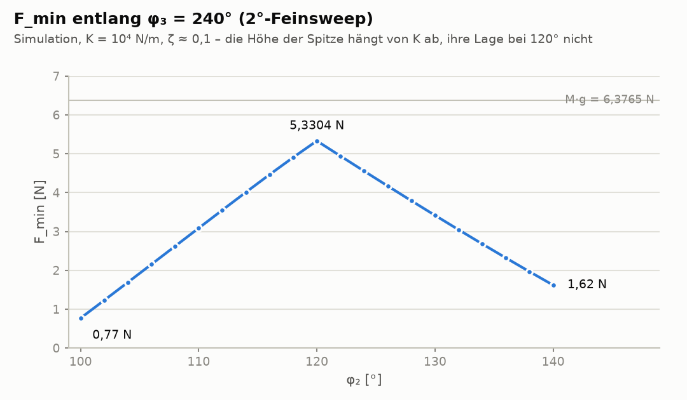
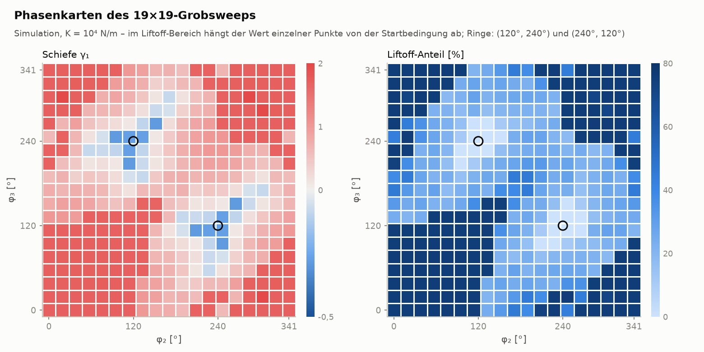
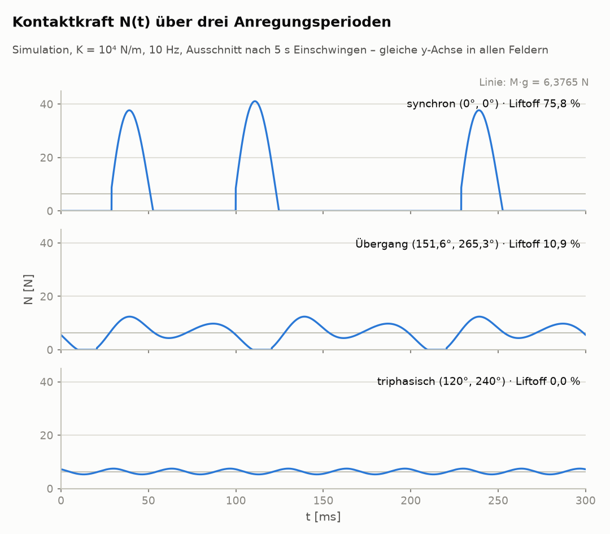

# PCMMS — Phasenkontrollierte Mehrmassensysteme

**Phase-Controlled Multi-Mass Systems**\
Matthias Früh · Gravidon Systemics Research · ORCID [0009-0005-9984-4207](https://orcid.org/0009-0005-9984-4207)\
Stand: 25. September 2026 · Status: prä-experimentell (Simulation; keine Messdaten)

---

## Worum es geht

Ein ruhender Körper steht auf einer Unterlage. In seinem Inneren bewegen sich drei Massen periodisch
mit demselben Profil, aber mit einstellbarer relativer Phasenlage (φ₂, φ₃). Untersucht wird, wie diese
Phasenkonfiguration die **zeitliche Form** der Kontaktkraft N(t) zwischen Körper und Unterlage bestimmt —
gemessen an Schiefe γ₁, Liftoff-Anteil λ, Asymmetrieverhältnis A = (F_max − M·g)/(M·g − F_min) und
Minimalkraft F_min.

Der Grundsatz des Projekts: **Es werden keine Kräfte gemessen, sondern Verschiebungen gegen eine
Referenz.** Die Referenz ist das Zeitmittel ⟨N⟩ = M·g, das aus dem Schwerpunktsatz folgt. Es ist kein
Ergebnis und kein Forschungsziel, sondern Randbedingung und Kontrollgröße: Jede beobachtete Abweichung
des Zeitmittels gilt als Apparaturfehler. Der Untersuchungsgegenstand ist die Wellenform, nicht das Mittel.

Ausdrücklich **nicht** behauptet werden: reaktionsloser Antrieb, Gravitationsmodifikation,
Gewichtsreduktion, Verschiebung des Zeitmittels. Ein früherer Simulationszyklus (v3a–v3d) berichtete eine
solche Verschiebung; sie wurde als Kontaktmodell-Artefakt erkannt, zurückgezogen und archiviert
([`docs/archiv_vermerk_kernhypothese_v3.md`](docs/archiv_vermerk_kernhypothese_v3.md)). Die alten Gleichungen bleiben als Nulllinie dokumentiert.

## Zwei Forschungslinien

- **Linie A (primär):** Wellenformstatistik der einseitigen Kontaktkraft eines *ruhenden* Körpers.
  Kein Effektanspruch; ⟨N⟩ = M·g als Erhaltungs-Nullgröße. Alles in diesem Repository gehört zu Linie A.
- **Linie B (optional, separate Apparatur):** gerichtete Nettobewegung durch Impulsübertrag an ein
  umgebendes Medium (Luft); das Medium ist der Reaktionspartner, das Vakuum der Nullfall. Linie B ist
  hier noch nicht abgelegt.

## Inhalt des Repositories

| Pfad | Inhalt |
|---|---|
| [`docs/overview.md`](docs/overview.md) | Wegweiser durch die Dokumente, Lesereihenfolge |
| [`docs/was_ist_pcmms.md`](docs/was_ist_pcmms.md) | Einstieg ohne Vorwissen |
| [`docs/werkstattbericht.md`](docs/werkstattbericht.md) | „Wellenform statt Mittelwert“ — der Stand für fachliche Leser |
| [`docs/expose_2026-09.md`](docs/expose_2026-09.md) | Projekt-Exposé (Kernfrage, Stand, messbares Signal, nächster Schritt) |
| [`docs/praeregistrierung_2026-06.md`](docs/praeregistrierung_2026-06.md) | Präregistrierung mit Falsifikationskriterien (Juni 2026, unverändert) |
| [`docs/einordnung.md`](docs/einordnung.md), [`docs/zehn_fragen.md`](docs/zehn_fragen.md) | Einordnung, Abgrenzung, Antworten auf die üblichen Einwände |
| [`docs/neuheitsgrad.md`](docs/neuheitsgrad.md) | Was daran nicht neu ist — und was übrig bleibt |
| [`docs/literaturabgleich_2026-09-12.md`](docs/literaturabgleich_2026-09-12.md) | Abgleich mit der Ratchet-, Tribologie- und Kontaktdynamik-Literatur, 12 verifizierte Referenzen, davon 10 mit DOI |
| [`docs/archiv_vermerk_kernhypothese_v3.md`](docs/archiv_vermerk_kernhypothese_v3.md) | Dokumentierter Rückzug der früheren Hypothese |
| [`code/`](code/) | Simulations-Engine ([`pcmms_v3a_phasen_sweep.py`](code/pcmms_v3a_phasen_sweep.py)), 2°-Feinsweep ([`finesweep.py`](code/finesweep.py)), analytische Lösung für den liftoff-freien Bereich ([`linear_solver.py`](code/linear_solver.py)) und Abbildungen ([`plot_figures.py`](code/plot_figures.py)) |
| [`docs/figures/`](docs/figures/) | Abbildungen aus den Simulationsdaten, je in heller und dunkler Fassung |
| [`data/`](data/) | Simulationsausgaben: 19×19-Phasensweep und 2°-Feinsweep ([`data/README.md`](data/README.md)) |

Die Präregistrierung v2 für die Messkampagne liegt als [Entwurf](docs/praeregistrierung_v2_entwurf.md) vor (nicht eingefroren, nicht registriert).

## Simulationsstand

Parametersatz der Engine (Simulationsreferenz für alle Zahlen in diesem Repository; Variablennamen aus
[`code/pcmms_v3a_phasen_sweep.py`](code/pcmms_v3a_phasen_sweep.py), Block „Systemparameter“):
M = 0,650 kg Gesamtmasse (drei Module à M/3; der Rahmen ist masselos, die gesamte Masse bewegt sich
mit den Modulen) · g = 9,81 m/s², M·g = 6,3765 N · f = 10 Hz ·
Egg-Profil: Halteanteil pro Zyklus 0,65 (`THOLD`), Anteil der schnellen Phase 1 − THOLD = 0,35 (`TFAST`),
Hold-Radius oben 5 mm (`RTOP`), Radius unten (schnelle Phase) RTOP·TFAST/THOLD ≈ 2,69 mm (`RBOT`, C¹-stetig),
Hub (Spitze-Spitze) RTOP + RBOT ≈ 7,69 mm ·
Kontakt: linear-elastisch K = 10⁴ N/m, viskos C = 16 N·s/m (ζ ≈ 0,1), unilateral (nur Druck, keine Zugkraft) ·
RK4, Δt = 50 µs · 15 s je Konfiguration, davon 5 s Einschwingen; ausgewertet werden die letzten 10 s.
Alle Datensätze sind Simulationsausgaben; **gemessene Daten existieren nicht.**

Namenshinweis: Die Referenz-Engine heißt [`pcmms_v3a_phasen_sweep.py`](code/pcmms_v3a_phasen_sweep.py); der Name wird beibehalten, obwohl das
Kürzel v3a auch den zurückgezogenen Simulationszyklus v3a–v3d bezeichnet. Mit dieser Engine wird das Zeitmittel
⟨F⟩ seit dem Rückzug als Kontrollgröße mit Zielwert M·g ausgewertet, nicht als Ergebnis
([`docs/archiv_vermerk_kernhypothese_v3.md`](docs/archiv_vermerk_kernhypothese_v3.md)).

- **19×19-Phasensweep** (361 Konfigurationen, [`data/sweep_19x19.csv`](data/sweep_19x19.csv)): ⟨F⟩ im Median 6,3765 N = M·g
  (Spannweite 6,333–6,383 N durch Einschwing- und Endlich-Fenster-Effekte bei hohem Liftoff) · Schiefe −0,29 … +1,98 ·
  Liftoff 0–76,2 % · F_max bis 50,6 N. Nur 12 Rasterpunkte um (120°, 240°) und (240°, 120°) sind liftoff-frei.
  Im Liftoff-Bereich ist die Karte nicht eindeutig: Physikalisch gleiche Konfigurationen (Module nur umbenannt)
  können in verschiedenen stationären Zuständen landen, etwa (0°, 113,7°) mit 75,6 % und (246,3°, 246,3°) mit
  18,2 % Liftoff. Die Spannweiten gelten, der Wert eines einzelnen Liftoff-Punkts hängt aber von der Startbedingung ab.
- **2°-Feinsweep** um (120°, 240°) (441 Konfigurationen, [`data/finesweep_2deg_120_240.csv`](data/finesweep_2deg_120_240.csv)):
  F_min bildet eine Zeltkurve mit Spitze 5,3304 N genau am Triphasik-Punkt, abfallend mit ≈ 0,23 N je Grad
  zu kleineren φ₂ und ≈ 0,19 N je Grad zu größeren φ₂ · 90,7 % des Fensters liftoff-frei · |⟨F⟩ − M·g| ≤ 0,2 mN durchgehend.
  Die Steigung ist ein Resonanzwert von K = 10⁴ N/m: Die zweite Harmonische liegt mit 2f/f_n = 1,013 auf der
  Kontaktresonanz (|H₂| = 5,03); bei festem ζ und K = 3·10⁴ … 10⁷ N/m beträgt sie 0,09–0,12 N je Grad
  (`python3 code/linear_solver.py --harmonics`).
- Ein Sinusprofil liefert ohne Liftoff keine Schiefe; das asymmetrische Bewegungsprofil ist für das
  Zielsignal zwingend.
- **Kontaktast analytisch:** Ohne Abheben ist das Modell linear. [`code/linear_solver.py`](code/linear_solver.py)
  berechnet die stationäre Lösung exakt aus Fourier-Reihe des Profils und Übertragungsfunktion des Kontakts
  (ca. 1 ms je Punkt) und trifft alle liftoff-freien Punkte der drei Datensätze auf ≤ 6·10⁻⁶. Die Phasenlage
  wirkt nur über den Faktor (1 + e^{−ikφ₂} + e^{−ikφ₃})/3 auf die k-te Harmonische; bei (120°, 240°) bleiben nur
  Vielfache der dritten Harmonischen übrig. Bleibt diese Lösung überall bei N > 0, existiert ein Kontaktast;
  streng folgt nur aus einem negativen linearen F_min, dass der Körper abhebt. Der Anteil des Phasenraums mit
  Kontaktast (1°-Raster) hängt stark vom Kontaktmodell und vom Anteil der bewegten Masse ab: 4,24 % bei
  K = 10⁴ N/m (Referenz), 76,1 % bei K = 10⁶ N/m mit ζ fest (68,5 % mit C = 16 N·s/m fest), 76,6 % bei starrer
  Auflage, 48,6 % bei K = 10⁴ N/m mit halber bewegter Masse. Bei der Referenz besteht der Kontaktast aus zwei
  Hauptgebieten um (120°, 240°) und (240°, 120°) (2 × 2524 Punkte, 3,90 %), in denen die Engine in allen Proben
  auf dem Kontaktast landet (412 Rasterpunkte der Datensätze vom Standardstart, `--validate`; im 3°-Raster um
  (120°, 240°) 280 Punkte × 7 Starts, nämlich Standardstart sowie ż₀ ∈ {0,5; 1,5; 3,0} m/s × t₀ ∈ {0; 0,05} s,
  je 20 s mit Auswertung der letzten 4 s, `--contact --grid`, ca. 6–8 min; dazu Würfe mit ż₀ = 3 m/s bei
  (98°, 240°) und (148°, 240°), `--contact`), und sechs Satelliteninseln (6 × 74 Punkte, 0,34 %, z. B. um (35°, 116°)). Die Inseln
  sind bistabil: Vom Standardstart der Engine aus hebt der Körper ab (Liftoff ≈ 75,8 %, F_max ≈ 39,5 N), vom
  linearen Orbit aus bleibt er in Kontakt (`python3 code/linear_solver.py --contact`). Die Bistabilität bleibt
  über 200 s und bei halbiertem Zeitschritt bestehen: Bei (35°, 116°) ergibt der Standardstart λ = 75,82 % bzw.
  75,81 % (Δt = 50 bzw. 25 µs), F_max 39,49 bzw. 39,48 N; der Start auf dem linearen Orbit λ = 0 %, F_max 19,81 N.
  Reproduzierbar mit `--contact --long` (ca. 20–25 min).

### Abbildungen

Alle Abbildungen zeigen Simulationsausgaben bei K = 10⁴ N/m; erzeugt mit
[`code/plot_figures.py`](code/plot_figures.py) aus den Dateien in [`data/`](data/).

<picture>
  <source media="(prefers-color-scheme: dark)" srcset="docs/figures/zeltkurve_dark.png">
  
</picture>

*F_min entlang φ₃ = 240° aus dem 2°-Feinsweep. Die Lage der Spitze folgt aus der Phasengeometrie, ihre
Höhe und die Steigung der Flanken hängen von der Kontaktsteifigkeit ab.*

<picture>
  <source media="(prefers-color-scheme: dark)" srcset="docs/figures/phasenkarten_dark.png">
  
</picture>

*Schiefe und Liftoff-Anteil über den ganzen Phasenraum. Liftoff-freier Kontakt tritt nur in der Nähe der
triphasischen Konfigurationen auf (höchstens 28° entfernt). Deutlich negative Schiefe (−0,2 bis −0,29) liegt
bis 40° um diese Punkte, schwach negative (bis −0,08) reicht weiter in den Übergangsbereich. Im Liftoff-Bereich hängt der Wert einzelner Zellen von der
Startbedingung ab (siehe oben).*

<picture>
  <source media="(prefers-color-scheme: dark)" srcset="docs/figures/wellenformen_dark.png">
  
</picture>

*Kontaktkraft N(t) für drei Phasenlagen, gleiche y-Achse: synchron hebt der Körper ab und landet mit
Spitzen um 40 N, triphasisch bleibt die Kraft in einem schmalen Band um M·g.*

Die Auslegung eines physischen Aufbaus (Bewegungsprofil, Wägezellen, Kalibrierung bei intermittierendem
Kontakt) ist davon getrennt und offen; siehe [`docs/expose_2026-09.md`](docs/expose_2026-09.md), Abschnitt „Nächster Schritt“.

## Nachrechnen

```bash
pip install -r code/requirements.txt
cd data
python3 ../code/finesweep.py --validate      # prüft die Feinsweep-Engine gegen sweep_19x19.csv
python3 ../code/pcmms_v3a_phasen_sweep.py    # voller 19×19-Sweep, schreibt nach ~/pcmms_outputs_v3a_sweep
python3 ../code/linear_solver.py --validate  # analytische Lösung gegen alle drei Datensätze (ca. 5 s)
python3 ../code/plot_figures.py              # Abbildungen nach docs/figures/ (ca. 40 s)
```

Der vollständige 19×19-Sweep braucht je nach Rechner 30–60 Minuten; das Skript ist checkpoint-fest.

## Zitieren

Siehe [`CITATION.cff`](CITATION.cff). Concept-DOI für alle Versionen dieses Repositorys: 10.5281/zenodo.________.
Frühere Stände (April–Mai 2026) liegen auf Zenodo unter *Früh, Matthias*; sie
dokumentieren den Weg, nicht den aktuellen Stand.

## Lizenz

- Code in [`code/`](code/): MIT, siehe [`LICENSE`](LICENSE).
- Dokumente in [`docs/`](docs/) und Daten in [`data/`](data/): CC BY 4.0, siehe [`LICENSE-CC-BY-4.0`](LICENSE-CC-BY-4.0).
  Namensnennung: „Matthias Früh, PCMMS“, https://github.com/matthias-frueh/phase-controlled-multi-mass-systems

---

*Summary (EN):* Pre-experimental study in classical mechanics. A body at rest carries three internally
oscillating masses with adjustable relative phases (φ₂, φ₃). The object of study is the waveform of the
unilateral contact force — skewness, liftoff fraction, asymmetry ratio, minimum force — not its time
average, which is fixed at M·g by the centre-of-mass theorem and serves as the null control. No claim of
reactionless propulsion, gravity modification or mean-force shift is made; an earlier mean-shift result
was identified as a contact-model artefact and retracted. All data here are simulation output.
