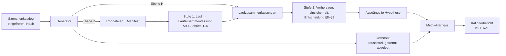

# AP-13 – Plan des Pipelinetests (Werkzeug 8): Planungs- und Kalibriersimulation

Stand 03.10.2026 (Nachbesserung nach Prüfung; Änderungen in Abschnitt 8) · Planungsdokument, nicht umgesetzt · ins Repository übernommen am 04.10.2026 mit dem Vermerk zur Regelgrundlage, angepassten Verweisen und dem Anhang „Abgleich mit `main`“; Inhalt sonst unverändert

> **Vermerk vom 04.10.2026 (Regelgrundlage).** Die Regeln, die dieser Plan als „AP-08-Entwurf“ zitiert
> (Entwurfsfassung der Entscheidungsregeln vom 2./3. Oktober 2026), sind mit PR #14 in `main` (`1b840de`) übernommen
> und dort als vorläufige Arbeitsfestlegungen gekennzeichnet (Präreg §0, §12, A0). Gegenüber den Annahmen des Plans ist festgelegt: Entscheidungslogik von H2 und H3
> nach Äquivalenzlogik (Fassung b; δ_H2 = ±1° und δ_H3 = ±10 % bleiben Testvarianten); D für Re/Im N_k in Fassung B,
> Fassung A nur Sensitivität; Δ_q = 0,25·D_q als Punktwert aus ŷ⁰, Faktor 0,1 nur Sensitivität; Δ_rel,q = Δ_q;
> gemeinsame Laufzahlbedingung P(H1 und H2 bestätigt | exakt) ≥ 0,8 statt „H2-Halbbreite ≤ 1°“; Berichtsform mit
> einem Zusatz je Ausgang; M = Σ_c F_c,stat/g aus P0.2 (Konvention b), Begriff „statische Last“. Neu in A9.11 und im
> Plan noch nicht enthalten: Schätzung von D_q, Δ_q und Δ_rel je Kampagne aus dem simulierten ŷ⁰ als
> Arbeitsfestlegung mit Szenarien, in denen N₃ unter Fassung B bindet; Kriterien für Zuordnung, H1Z und E3.
> Unverändert gültig: Architektur, Katalog im Übrigen, Budget, Prüfschwelle 0,069, Überdeckung 0,936, getrennter
> Rauschbias, Startwert Δ_q/5,01 bzw. 5,21. Einzelheiten mit Fundstellen im Anhang „Abgleich mit `main`“ am Ende dieses Dokuments.
> Der Plan ist nicht überarbeitet; die weiter offenen Regeln bleiben in §12 dokumentiert, eine Entwicklungsaufgabe
> (Werkzeug 8) ist derzeit nicht angestoßen (Vorgabe des Autors).

*Nur Planung und Simulation, keine Messdaten.* Dieses Dokument enthält keinen Code für das Repository. Es legt fest, was Werkzeug 8 der Präregistrierung v2 (§12 Nr. 8, Anhang A9.11) leisten muss, wie es aufgebaut wird und in welcher Reihenfolge. Alle Zahlen sind Modellrechnungen mit angenommenen Rauschmodellen. Offene Hardwareentscheidungen bleiben offen; Abschnitt 5.4 führt sie mit Optionen und Folgen.

Lesehilfe: [Quelle] = Repo-Dokument mit Fundstelle, [Rechnung] = Nachrechnung der Gesamtprojektanalyse (IDs STA-, KM-, AUS-, LB-nn) oder eigene Kurzmessung dieses Pakets, [Einschätzung] = begründete Schlussfolgerung, [Annahme] = gesetzte Größe, [Vorschlag] = Planfestlegung, die der Autor bestätigen muss. „Präreg“ = `docs/praeregistrierung_v2_entwurf.md` und `docs/praeregistrierung_v2_anhang.md`. „AP-08-Entwurf“ = die Entwurfsfassung der Entscheidungsregeln (AP-08), letzter Stand vom 02.10.2026 nach Prüfung und Nachbesserung, mit PR #14 als vorläufige Arbeitsfestlegungen in die Präreg übernommen (Vermerk oben, Anhang): IUT-TOST gegen ŷ⁰ und ŷ¹, Mindesteffekttest, simuliertes c mit Biaskorrektur und Prüfschwelle 0,069 (nur Poolen), H2-Intervall mit Rückfallkette und Schwelle 0,936, Rauschbias getrennt für ŷ⁰ und ŷ¹, Entscheidungslogik von H2 und H3 offen. „bestätigt“ heißt im AP-08-Entwurf „äquivalent“, „falsifiziert“ heißt „relevant abweichend“.

Verweise: Die Nachrechnungen (STA-, KM-, AUS-, LB-nn) liegen mit Protokollen und Skripten unter
[`../rechnungen/`](../rechnungen/README.md) (Gruppen `statistik`, `kippmoment`, `auslegung`, `linie_b`); „P2-Statistik“
bezeichnet die Gruppe [`../rechnungen/statistik/`](../rechnungen/statistik/PROTOKOLL.md). Die Kurzmessungen dieses
Plans (Abschnitt 4.1) liegen unter [`../rechnungen/ap13_kurzmessung/`](../rechnungen/ap13_kurzmessung/README.md), die
„AP-08-Kontrolle“ (Kontrollrechnung zur Entwurfsfassung der Regeln) unter
[`../rechnungen/ap08_kontrolle/`](../rechnungen/ap08_kontrolle/README.md). Bezeichnungen wie B01, B04, B08, B11 oder
„Kandidat #60“ verweisen auf Bewertungsbündel und Kandidaten der Gesamtprojektanalyse (Arbeitsdokumente, nicht im
Repository); die zugehörigen Bewertungsrechnungen stehen unter [`../rechnungen/bewertung_a/`](../rechnungen/bewertung_a/PROTOKOLL.md),
[`../rechnungen/bewertung_b/`](../rechnungen/bewertung_b/PROTOKOLL.md) und [`../rechnungen/zusatz_p2/`](../rechnungen/zusatz_p2/PROTOKOLL.md).

## Kurzfassung

1. **Ziel.** Werkzeug 8 prüft, ob die registrierte Auswertekette Abweichungen richtig erkennt und ob die Fehlerraten halten. Es liefert außerdem Planungsgrößen für Teil B: n_min, n₀, den Rauschbias b̂⁰ und b̂¹, den kritischen Wert c von H1, den Intervalltyp von H2 und das Quantil für ε_ctrl.
2. **Architektur.** Ein Generator erzeugt synthetische Kampagnen aus einem eingefrorenen Szenarienkatalog. Die Auswertung läuft zuerst gegen eine Referenzimplementierung der Regeln aus dem AP-08-Entwurf und wird später gegen das Auswerteskript aus AP-12 getauscht. Ein Metrik-Harness zählt die Ausgänge gegen die bekannte Wahrheit.
3. **Zwei Rechenebenen.** Ebene Z erzeugt Zeitreihen der drei Zellen und Rohdateien (End-zu-End-Test). Ebene H erzeugt je Lauf nur die Harmonischen und Kenngrößen (Massenkalibrierung). Das verlangt von AP-12 eine Trennung in Stufe 1 (Lauf → Laufzusammenfassung) und Stufe 2 (Laufzusammenfassungen → Entscheidung).
4. **Katalog.** Rund 160 Szenariopunkte in elf Gruppen. Zuerst nichtlineare Mismatches für H1, dann 3-FG gegen 1-FG, H3-Mismatch, nichtlinearer Nebenschluss, LTI-Artefakte und Drift, S₃-Prüffall, Vorzeichen-Inversionstest. Für jede Hypothese gibt es mindestens ein Szenario mit Annahmenbruch (Zirkularitätsregel).
5. **Rechenbudget.** Gemessen: eine Kampagne auf Ebene H mit Bootstrap A nach A9.5 0,30 s (n = 20, B = 1000), 0,41 s (n = 40), 0,61 s (n = 80); eine H2-Kampagne mit drei Zeltfits je Replikat 0,20–0,70 s einschließlich Jackknife für BCa; ein Lauf auf Ebene Z 0,08 s bei 8,5 kHz. Der Zeltfit nach A9.6 ist nur mit einem exakten Kandidatenverfahren bezahlbar; das Vollraster kostet etwa das 50-Fache. Hochgerechnet auf ≥ 1000 Kampagnen je Szenariopunkt und Präzisionsstufe L0–L5, beide Betriebsarten: etwa 200–235 Kernstunden, auf vier Kernen etwa 50–60 Stunden.
6. **Abhängigkeiten.** Generator, Katalog, Referenzregeln, Zeltfit und Harness sind ohne AP-12 baubar. Die Endabnahme braucht AP-12. AP-08 liefert die Regeln, AP-09 die Identifizierbarkeitsläufe, AP-06/07 die Kanäle, AP-10 das Rohdatenformat, AP-11 das Anpassverfahren für H3 (weiche Abhängigkeit).
7. **Aufwand.** Fünf Meilensteine, zusammen etwa 8–13 Personentage plus Rechenzeit [Einschätzung]. Davon zählt etwa 1 PT (Referenzregeln) nach dem Arbeitsplan zu AP-08. Der Rest liegt über der P3-Schätzung von 3–5,5 PT, weil Schnittstelle, Ebene Z, exakter Zeltfit, mechanismusbasierte Kopplung, neue Kontaktgesetze und Gruppe C hinzukommen.
8. **Grenze.** Die Kalibrierung vor dem Einfrieren beruht auf angenommenen Rauschmodellen. Die Kalibrierung mit realen Kovarianzen folgt erst nach Phase 0 (AP-21) und kann die Laufzahl oder sogar die Zulässigkeit von f ändern.

---

## 1 Ziel und Abnahmekriterien

### 1.1 Ziel

Frage aus dem Arbeitsplan: Erkennt die Kette Abweichungen richtig, und halten die Fehlerraten? [Quelle: Arbeitsplan AP-13]

Präreg §12 Nr. 8 verlangt: Synthetische Daten mit exakter Superposition müssen H1 bestätigen, Daten mit Hertz-Kontakt oder Modulkopplung über Δ müssen es falsifizieren; je Szenario 1000 Kampagnen für Fehlerraten, Überdeckung, Power, n_min, n₀, Rauschbias und das Quantil für ε_ctrl [Quelle: Präreg §12 Nr. 8]. Der AP-08-Entwurf präzisiert: Falsifikation mit Wahrscheinlichkeit ≥ 0,8, wenn das größte Residuum mindestens 2·Δ_rel beträgt; knapp über Δ_rel ist „nicht entscheidbar“ der erwartete Ausgang [Quelle: AP-08-Entwurf §12 Nr. 8, A9.11]. A9.11 ergänzt die Rate „nicht entscheidbar“ und die Bestätigungswahrscheinlichkeit von H4 (berichtet, keine Bedingung) [Quelle: Präreg A9.11]. Nach §6 gilt als Codefehler nur ein Fehler, der an den synthetischen Daten des Pipelinetests nachweisbar ist [Quelle: Präreg §6, Datenschluss]. Der Pipelinetest bestimmt damit auch, was nach dem Datenschluss noch korrigiert werden darf.

Werkzeug 8 hat drei Aufgaben:

| Aufgabe | Zeitpunkt | Eingang | Ergebnis |
|---|---|---|---|
| Pipelinetest | vor dem Einfrieren von Teil A, erneut vor dem Datenschluss | synthetische Kampagnen mit bekannter Antwort | Nachweis, dass Kette und Code richtig rechnen; eingefrorener Prüfdatensatz für die Codefehler-Regel |
| Kalibriersimulation | vor dem Einfrieren (angenommene Rauschmodelle L0–L5) und in Teil B (Pilotkovarianzen) | Szenarienkatalog, Regeln aus Teil A | Fehlerraten, Power, Überdeckung, c (H1) mit Prüfrate, Wahl des H2-Intervalltyps mit Nominalniveau |
| Planungssimulation | Teil B (AP-21); vorher als Verfahrensprobe | Pilotkovarianzen, p̂, Struktur aus Werkzeug 2 | n_min, n₀, Rauschbias b̂_i⁰ und b̂_i¹ mit u(b̂_i⁰), u(b̂_i¹), Quantil für ε_ctrl, H4-Wahrscheinlichkeit |

AP-13 baut das Werkzeug und führt die Kalibrierung vor dem Einfrieren durch. Die Neukalibrierung mit gemessenen Kovarianzen gehört zu AP-21.

### 1.2 Zwei Betriebsarten der Kalibrierung

- **Raster (Vergleichbarkeit).** Feste Laufzahl n = n₀ = 20, n₁ = 21, wie die P2-Statistik und die AP-08-Kontrollrechnung [Rechnung: STA-08; AP-08-Kontrolle]. Präzisionsstufen L0–L5 (Tabelle 2.3). Diese Betriebsart zeigt das Verhalten der Regeln über die Präzision, auch das Präzisionsparadox.
- **Geplant (Kriterien).** Je Stufe in dieser Reihenfolge: Planung nach §5.4 (n_min, n₀), Rauschbias b̂⁰ und b̂¹ bei dieser Laufzahl, c mit Biaskorrektur, Prüfrate von c in einer zweiten Simulation, dann die Szenarien bei dieser Laufzahl. Die Kriterien K05, K07 und K21 gelten in dieser Betriebsart, so verlangt es der AP-08-Entwurf (A9.11: „bei der nach §5.4 geplanten Laufzahl“). Startwert der Suche ist die Auslegungsgrenze für 294 Intervalle (Δ_q/5,01 für ν → ∞, Δ_q/5,21 für ν = 19); maßgeblich ist die Planungssimulation [Quelle: AP-08-Entwurf §8.5, A8]. Übersteigt die geplante Laufzahl n_max, ist das ein regulärer Befund („f unzulässig“ auf dieser Stufe), kein Fehler des Werkzeugs.

### 1.3 Abnahmekriterien

Grundlage sind AP-13 im Arbeitsplan, die Kriterien aus B08/B11, A9.11 der Präreg und A9.11 des AP-08-Entwurfs. Wo die Fassungen voneinander abweichen, steht die allgemeinere Form; die besondere Form ist als Prüffall genannt. Wo der AP-08-Entwurf eine Zahl des Arbeitsplans ersetzt, gilt der Entwurf, und die Abweichung ist genannt (Überdeckung 0,936 statt 0,95; Prüfrate von c nur berichtet).

| Nr. | Kriterium | Soll | Quelle | geprüft mit |
|---|---|---|---|---|
| K01 | P(falsifiziert \| exakte Superposition) | ≤ 0,05 auf jeder Stufe, beide Betriebsarten | Arbeitsplan AP-13; B08; Präreg A9.11 | N01–N04, N08 |
| K02 | P(falsifiziert \| LTI-Artefakt oder Drift der Einzelmodulbasis) | ≤ 0,05 | Arbeitsplan; B11 | E01–E09, B01–B04, D01 |
| K03 | P(falsifiziert \| größte wahre Abweichung < Δ_rel) | ≤ 0,05 | Arbeitsplan; B08; AP-08-Entwurf | N06, A01–A07 mit Residuum < Δ_rel |
| K04 | P(bestätigt \| eine Größe genau an ±Δ_q) – Rate der IUT-Bestätigung über 147 korrelierte Tests | ≤ 0,05 | AP-08-Entwurf A9.11; Arbeitsplan („IUT-Raten für 147 korrelierte Tests“) | N05 |
| K05 | P(bestätigt \| exakt) | ≥ 0,8 bei geplanter Laufzahl | Präreg §5.4; Arbeitsplan | N01, N07 |
| K06 | P(bestätigt \| exakt) nicht fallend mit der Präzision | Folge L5 → L0 nicht fallend, Toleranz zwei MC-Standardfehler; ebenso für irrelevante kleine Abweichungen (Kopplung 1 %, 3 %; N₂ 1 %, 3 %; Drift 1 %) | Arbeitsplan; B08 | N01, N06 |
| K07 | Power gegen Kopplung: P(falsifiziert \| Kopplung mit Residuum ≥ 2·Δ_rel) | ≥ 0,8 bei geplanter Laufzahl; Prüffall A4-Beispiel: Kopplung 20–30 % (≈ 1,9–2,8·Δ_F) | AP-08-Entwurf A9.11; Arbeitsplan; B11 („Power ≥ 0,8 oberhalb Δ“) | A04, A05 |
| K08 | – (entfallen) | Die Prüfrate von c ist seit der Nachbesserung des AP-08-Entwurfs kein Kriterium mehr; sie steht in K15 | AP-08-Entwurf §8.4, A9.11 | – |
| K09 | H2 entscheidbar bei u_c,erw = 0,3–1 mN | Fitfenster in jeder Kampagne definiert; P(H2 bestätigt \| exakt) ≥ 0,8 bei geplanter Laufzahl [Vorschlag für die Lesart von „entscheidbar“]; geprüft an den Enden des Bereichs, L0 (0,26 mN) und L1 (0,99 mN) | Arbeitsplan; B08 | H01–H02, N01 |
| K10 | Überdeckung des H2-Intervalls | Das nach §8.6 gewählte Intervall erreicht die simulierte Überdeckung 0,936: das Perzentilintervall, sonst BCa, sonst das Perzentilintervall mit dem kleinsten Nominalniveau aus 0,96, 0,97, 0,98, 0,99, das 0,936 erreicht. Reicht auch 0,99 nicht, ist H2 nicht entscheidbar und das Kriterium verfehlt (Rückmeldung an AP-08). Je Stufe und Fenstervariante, auch beim symmetrischen Zelt | AP-08-Entwurf §8.6, A9.6, A9.11; der Arbeitsplan nennt ≥ 0,95 (durch den Entwurf ersetzt) | H01–H05, N01, N03 |
| K11 | P(H3 bestätigt \| Mismatch über PB3) | ≤ 0,05 | Arbeitsplan; B11 | C01–C03 |
| K12 | Planung nach §5.4 | n_min, n₀ werden nach der Regel gefunden, Startwert aus der Auslegungsgrenze für 294 Intervalle; Rechenweg und Eingänge dokumentiert | Präreg §5.4, A9.2; AP-08-Entwurf §8.5, A8 | N07 |
| K13 | Rauschbias | b̂_i⁰ (n_min Läufe, n₀ Einzelmodulläufe je Modul) und b̂_i¹ (n_min Läufe, n + d Kontrollläufe je Modul) mit u(b̂_i⁰), u(b̂_i¹) je Schnittpunkt; u(b̂) aus Monte-Carlo-Fehler und halber Spannweite über die Rauschmodelle (Rechteck); nach Korrektur \|E[r_i⁰(F_min)] − b̂_i⁰\| und \|E[r_i¹(F_min)] − b̂_i¹\| ≤ 0,1·u_c,erw,i [Vorschlag]; dieselbe Korrektur in der Simulation von c | Präreg §5.4; AP-08-Entwurf §5.4, §8.3, §8.4, A9.5 | N04, N01 (Triphasik-Punkt) |
| K14 | Quantil für ε_ctrl | 95-%-Quantil der Prüfgröße F aus 10 000 simulierten Datensätzen mit der Laufanordnung von Phase 0 | Präreg A9.8 | S07 |
| K15 | Berichtsgrößen ohne Bedingung | Rate „nicht entscheidbar“; Power gegen Kopplung und Hertz-Kontakt; Bestätigungswahrscheinlichkeit von H4; Prüfrate von c (Anteil der Kampagnen mit mindestens einem \|z⁰\| > c bei exakter Superposition in einer zweiten, unabhängigen Simulation mit 1000 Kampagnen; über 0,069 gilt das gepoolte Quantil nach §8.4, kein verfehltes Kriterium); Raten der Zusätze „Abweichung nachgewiesen, kleiner als Δ_rel“ und „Drift der Einzelmodulbasis“; H2 und H3 in beiden Entscheidungslogiken (Signifikanz; Äquivalenz mit ±δ_H2 bzw. PB3) über die Präzision | Präreg A9.11; AP-08-Entwurf §8.4, §9.3, §12, A9.11 | alle; Prüfrate N02 |
| K16 | S₃-Prüffall | sechs äquivalente Bilder gleich auf ≤ 10⁻⁹ N, Phasenregel auf ≤ 10⁻⁶°; mit 1 % Massenungleichheit weicht der modellfreie Vergleich um die erwartete Leckage ab (≈ 0,015 N in N₁ bei μ ≈ 0,46), die Superpositionsvorhersage nicht | Arbeitsplan AP-12; B01; KM-09 | F01–F03 |
| K17 | Vorzeichen-Inversionstest | S = N₊ + N₋ − 2Mg verschwindet bis auf den numerischen Boden für LTI-Anteile und lineare Kopplung; für gerade Nichtlinearitäten stimmt S mit der Generatorwahrheit überein | Arbeitsplan AP-13 (neue Option) | G01–G04 |
| K18 | Identifizierbarkeitsläufe | Zuordnung zu den Klassen Nichtlinearität (∝ A²), lineare Kopplung (∝ A), Drift (konstant) mit Trefferquote ≥ 0,8 für 0,1 % Aktorkopplung und eine Kettennichtlinearität mit ≥ 1 mN H1-Wirkung; Kontakt und Kette fallen erwartungsgemäß in dieselbe Klasse | Arbeitsplan AP-07, AP-09; B04 (eingeschränkt) | I01–I06 |
| K19 | Ebenen Z und H konsistent | auf L0, L2, L4: u_c-Mediane je Größe innerhalb 5 %, Raten der Ausgänge innerhalb zwei MC-Standardfehlern [Vorschlag] | Planfestlegung (Abschnitt 2.3) | N01 auf Ebene Z |
| K20 | Einfrieren | Katalog, Kriterien, Seeds und Prüfdatensatz vor Teil A mit Hash eingefroren; spätere Änderungen in A0 | Arbeitsplan; B11 | – |
| K21 | Power gegen Hertz-Kontakt: P(falsifiziert \| Hertz-Kontakt mit Residuum ≥ 2·Δ_rel) | ≥ 0,8 bei geplanter Laufzahl, sofern A07 einen solchen Punkt im Kontaktast liefert; sonst „nicht prüfbar“ mit Grund; in jedem Fall berichtet (K15) | Präreg §12 Nr. 8; AP-08-Entwurf §12 Nr. 8 und A9.11 Absatz 1 (dort verlangt), Kriterienliste von A9.11 (dort nur berichtet); Klärung als Rückmeldung an AP-08 (5.3) | A07 |

Zuarbeiten an andere Pakete, ohne eigenes AP-13-Kriterium: synthetische P0.4- und P0.5-Daten für das Anpassverfahren (AP-11: K, ζ, Δδⱼ mit u(Δδⱼ) ≤ 0,1° wiederfinden; gebaut in M2); Abbildung von Kanalspezifikation auf u_c,erw (AP-06: Ziel-u_c erreichbar); H1-Wirkung der Dämpfungsasymmetrie gegen 0,3·c·u_c (AP-05).

### 1.4 Wann ein Kriterium als erfüllt gilt

Bei 1000 Kampagnen beträgt der Monte-Carlo-Standardfehler einer Rate 0,05 genau 0,0069, einer Rate 0,8 etwa 0,0126 [Rechnung: Binomialformel]. Der AP-08-Entwurf nutzt diese Größe für die Schwelle 0,936 der H2-Überdeckung; die Prüfschwelle 0,069 für c rechnet zusätzlich den Schätzfehler von c ein (zusammen 0,0097) [Quelle: AP-08-Entwurf §8.4, §8.6, A8]. Vorschlag für alle übrigen Kriterien: Entscheidend ist der Punktschätzer. Liegt er innerhalb von zwei Standardfehlern um das Soll, wird der Szenariopunkt mit 4000 Kampagnen nachgerechnet, und dann zählt dieser Wert [Vorschlag].

Erfüllt die Kalibrierung vor dem Einfrieren ein Kriterium nicht, werden die Regeln von §8.4–§8.6 überarbeitet und die Änderung in A0 vermerkt (AP-08-Entwurf A9.11). AP-13 entscheidet die Regelfragen nicht, sondern liefert die Grundlage.

---

## 2 Architektur

### 2.1 Überblick



Stufe 1 und Stufe 2 stellt zunächst die Referenzimplementierung (2.4), später AP-12. Der Generator und der Harness gehören zu Werkzeug 8. Die Wahrheit liest nur der Harness.

### 2.2 Generator synthetischer Kampagnen

**Kampagnenplan.** Der Generator erzeugt eine vollständige Kampagne in der Reihenfolge der Präreg:

- Phase 0: P0.1 (statische Lasten an ≥ 5 Stellen, Brückensimulator), P0.3 (D1, D2), P0.4 (komplexe Übertragung je Zelle und Summe, zwei Amplituden, bei Bedarf exzentrisch), P0.5 (Wegkanal, Profilharmonische, Δδⱼ), P0.6 (Sollphasen, Jitter), P0.7 (≥ 42 Referenzläufe, verschachtelt), P0.8 (n₀ Einzelmodulläufe je Modul), Pilotläufe (110°, 250°), (130°, 230°), (110°, 252°) [Quelle: Präreg A9.2, §5.4].
- Phase 1: Blöcke nach §6 mit Kontrollsätzen (R, L₁, L₂, L₃), Referenzlauf nach der zwölften Konfiguration, Messtagen mit Aufwärm- und Schlussreferenzläufen, Wiederholungen ungültiger Läufe [Quelle: Präreg §6, A9.12]. Die Reihenfolge erzeugt ein eigener, gesäter Generator nach der Regel von §6, bis Werkzeug 7 (AP-10) vorliegt.
- Laufarten: R, Lⱼ, Kombinationslauf, D1, D2, Pilot; dazu nach AP-09 Identifizierbarkeitsläufe (zweite Amplitude oder Frequenz an ≥ 3 Schnittpunkten, Paarläufe, D2 in Kombinationskonfiguration) und für Gruppe G invertierte Läufe.

**Bausteine.**

| Baustein | Inhalt | Grundlage im Repo | neu zu bauen |
|---|---|---|---|
| lineare Physik | stationäre Antwort im Dauerkontakt, Summe und drei Zellen, 3 FG (Hub, zwei Kippungen), ungleiche Module, Zell- und Modullage, k_max | `code/auslegung.py`, Klasse `Aufbau`, Methode `loesen` (Summe = `linear_solver` auf ≈ 10⁻¹⁴ N; 3-FG-Zellwerte auf 5 Stellen) [Quelle: `docs/abnahme_ap02_ap03.md` §3] | Adapter auf Laufebene; unabhängige Gegenprobe der Generatorwahrheit (Zirkularitätsregel Z3): Vorlage ist das eigens hergeleitete 3-FG-Modell der P3-Gegenprüfung (Lagrange-Ansatz, Fourier-Koeffizienten des Egg-Profils analytisch statt per FFT; [`../rechnungen/zusatz_p2/zm.py`](../rechnungen/zusatz_p2/zm.py)); wird neu geschrieben und getestet, keine Übernahme ins Repo |
| nichtlineare stationäre Physik | periodische Lösung im Kontakt mit Kelvin-Voigt- oder Hunt-Crossley-Gesetz, Newton-Schießverfahren | `code/ereignisloeser.py` (`System`, `startzustand(…, 'orbit')`, `newton`, `simulate`), 1 FG | Kontaktgesetze „Hertz-Glied in Reihe zur linearen Zelle“, „richtungsabhängige Dämpfung“ und reiner Hertz-Kontakt mit weicher Auflage (A07); schneller Pfad über die Störungsformel R_k (2.2, unten) |
| Liftoff und Hüpfen | Flugphasen, Aufsetzer, Stoßspitzen, Hüpfzustände nach Stößen | `code/ereignisloeser.py`, `code/einzugsgebiete.py`; Attraktorkarten in `docs/einzugsgebiete_v1_kandidat.md`; Zellkräfte im Dauerkontakt aus `code/auslegung.py` | Beginn des Einzelzell-Liftoffs über die linearen 3-FG-Zellkräfte; Übertrag in Zellsignale; Einzelzell-Liftoff mit Dynamik braucht ein nichtlineares 3-FG-Modell (Option, 2.2 unten) |
| Messkette | Kalibrierung je Zelle, Kennlinie (quadratisch, kubisch), Verstärkungsfehler, Zelllagefehler, Übersprechen, Kanalversatz, Quantisierung, Übersteuerung, analoges Anti-Aliasing-Filter | – | ganz neu |
| Rauschen und Streuung | getrennte Modelle für Einzelmodul- und Kombinationsläufe (unten) | Modelle der P2-Statistik (Stufen L0–L5) [Rechnung: STA-03, STA-08] | Neuimplementierung mit Tests |
| Jitter | Indexphase je Zyklus normalverteilt, σ ≤ 56 µs (0,2° bei 10 Hz); Modul 1 definiert θ; erfasster Teil über ρⱼₖ, nicht erfasster Rest Encoder ↔ Masse | Präreg A2.4, §8.2 | Neuimplementierung |
| Kopplung | parametrisch (multiplikativ je Harmonischer) und mechanismusbasiert (je Antriebsoption) | – | ganz neu; Mechanismusmodell hängt am Antriebsentscheid (5.4) |
| Artefakte | D2-Signaturen (Einstreuung, Vibration), Blindkanal, Luft-Zusatzmasse, Elektrostatik, Kabel, Nebenschluss, Drift | Größenordnungen aus LB-10/11/13, STA-11 | ganz neu |
| Wahrheit | rauschfreie Erwartungswerte je Konfiguration und Größe, wahre Residuen gegen die wahre Superposition, Klasse der erwarteten Antwort (3.5) | – | ganz neu |

**Rauschmodelle, getrennt für Einzelmodul- und Kombinationsläufe.** Das Verhältnis der Rauschpegel von Mess- und Vorhersageseite bestimmt den Rauschbias am Triphasik-Punkt; mehr Läufe helfen dort nicht [Rechnung: STA-04 mit Gegenprüfung]. Der Generator führt deshalb jede Komponente mit eigener Stärke je Laufart:

| Komponente | Einzelmodullauf Lⱼ | Kombinationslauf | Stand |
|---|---|---|---|
| weißes Sensorrauschen je Zelle, σ je Abtastwert | ja | ja | [Annahme] 1–20 mN [Rechnung: STA-02] |
| Lauf-zu-Lauf-Streuung der Modulamplitude | nur Modul j | alle drei Module | [Annahme] Stufen L0–L5 |
| nicht erfasster Phasenrest Encoder ↔ Masse | nur Modul j | alle drei | [Annahme] |
| Jitter je Zyklus, über ρⱼₖ erfasst | Index von Modul j | Module 2, 3 gegen Modul 1 | Präreg A2.4 |
| lastabhängige Zusatzstreuung (nur bei Wechselwirkung) | nein | ja, Szenarien A05, A06 | [Annahme] |
| 1/f-Anteil und Drift innerhalb eines Laufs | ja | ja | [Annahme]; prüft G4 |
| Drift zwischen Läufen, Messtagen und Phasen (Temperatur, Verstärkung) | ja | ja | [Annahme]; prüft ŷ¹, S3, G7 |

Stufen L0–L5 wie in der P2-Statistik, damit die Ergebnisse vergleichbar bleiben [Rechnung: STA-08]:

| Stufe | Streuung je bewegtem Modul (Amplitude / Phase) | u_c(F_min) im A4-Beispiel, n = n₀ = 20 |
|---|---|---|
| L0 | nur Sensorrauschen und Jitterrest (0,02°) | 0,26 mN |
| L1 | 0,3 % / 0,03° | 0,99 mN |
| L2 | 1 % / 0,1° | 3,3 mN |
| L3 | 3 % / 0,3° | 9,8 mN |
| L4 | 6 % / 0,6° | 19,6 mN |
| L5 | 10 % / 1° | 32,3 mN |

Unter modulproportionaler Streuung bindet ab L1 Re/Im N₁, nicht F_min [Rechnung: STA-01 nach Gegenprüfung]. Der Harness weist deshalb alle Größen getrennt aus. Gemessene Rauschdichten und Lauf-zu-Lauf-Streuungen gibt es nicht; die Stufen sind ein Raster, keine Erwartung.

**Ungleiche Module.** Masse, Hub, Profilversatz Δδⱼ und Profilform (Hochfrequenzanteile) je Modul frei wählbar. Ungleiche Module wurden für H1 bisher nicht simuliert [Rechnung: STA, offene Punkte]. Sie entschärfen den Minimum-aus-drei-Effekt am Triphasik-Punkt; schon 0,1 % Amplitudenunterschied trennt die Minima um 1–2 mN [Rechnung: STA-04, Gegenprüfung].

**Kippmoden.** Über das 3-FG-Modell von `auslegung.Aufbau` (Geometrien G0, G60h, „zentral“, freie Zell- und Modullagen, unsymmetrische Zellsteifigkeiten, exzentrischer Schwerpunkt). Das Modell gilt im Dauerkontakt; Abheben rechnet es nicht [Quelle: Kopf von `code/auslegung.py`, Abschnitt „Grenzen“].

**Liftoff und Hüpfen.** G6 und S2 sind als Einzelzell-Liftoff definiert: ein Rohwert N_c < F_LO,c in einer Zelle, auch wenn die Summe groß bleibt [Quelle: Präreg §4, §9.1, §9.2]. Der Generator bildet drei Fälle ab, mit verschiedener Reichweite:

- (a) **Beginn des Einzelzell-Liftoffs, linear 3 FG.** `auslegung.Aufbau` liefert die Zellkräfte im Dauerkontakt. Am V1-Kandidaten (ε = 0,57) mit G0 hebt im linearen Modell eine Zelle bei ε_c ≈ 0,97–1,00 ab, die Summe erst bei ε_c ≈ 2,4–3,8 (Schnitt) bzw. 3,0 (Einzelmodullauf); mit G60h liegen die Zellen in den Pflichtläufen bei ε_c ≈ 1,26–2,0 (Zusatzkonfigurationen bis 1,0 herab) [Rechnung: Kurzmessung `auslegung.py --runs`, V1-G0 und V1-G60h]. Wird der Hub so skaliert, dass das lineare Zellminimum F_LO,c erreicht, entsteht genau der typische erste Fall: eine Zelle an der Schwelle, die Summe mit großer Reserve im Kontakt. Das prüft, ob G6 und S2 einsetzen, auch knapp an der Schwelle (S01a). Unterhalb von null gilt das lineare Modell nicht mehr. Der Generator schneidet die Zellkraft dort bei null ab, ohne Stoßdynamik. Solche Läufe werden nur auf G6, S2 und die Folgeregeln (§9.1, §9.2, A9.12) geprüft, nicht auf Zahlenwerte.
- (b) **Liftoff aller Zellen und Hüpfen, 1 FG.** Über `code/ereignisloeser.py`: Würfe aus dem Kontaktast, Hüpfzustände mit Stoßspitzen, Frequenzrampe. Der Löser hat einen Freiheitsgrad und keine Kippmoden [Quelle: `docs/abnahme_ap02_ap03.md` §3, Lücken]. Die Zellsignale entstehen über eine feste Aufteilung der Summe (Geometrie „zentral“); dann heben alle Zellen zugleich ab. Das prüft Abbruchpfad und Monitor (S01b, S03), nicht den Einzelzellfall.
- (c) **Einzelzell-Liftoff mit Dynamik.** Stöße auf einer Zelle und ihre Rückwirkung auf die Summe brauchen ein nichtlineares 3-FG-Modell mit einseitigem Kontakt je Zelle. Es liegt nicht im Repo. Eine Rechnung der Gesamtprojektanalyse mit einem solchen Modell zeigt: Schon 12–17 % Einzelzell-Liftoff verfälschen die Summen-Observablen deutlich, während die Summe im Kontakt bleibt [Rechnung: KM-07]. **Offen – Option**: Neuimplementierung nach M3. Ob sie lohnt, hängt am Geometrieentscheid (5.4), weil die Lage bestimmt, welche Konfigurationen zuerst eine Zelle entlasten.

**Schneller Pfad für Nichtlinearität.** Die Störungsformel R_k = (1 − H(kω))·q·FT[(Σⱼ yⱼ)² − Σⱼ yⱼ²]_k mit q = K₀/(4δ₀) reproduziert den Hertz-Kontakt bis f_n0 ≥ 120 Hz auf ≤ 10 % [Rechnung: STA-11, Gegenprüfung]. Sie dient für dichte Power-Kurven. An ausgewählten Punkten wird sie gegen den Löser geprüft; unter 120 Hz und nahe Resonanzen k·f ≈ f_n gilt nur der Löser.

**Nichtlinearität und Laufstreuung.** In nichtlinearen Szenarien hängt die Antwort eines Laufs von den Amplituden und Phasen aller bewegten Module dieses Laufs ab. In Kombinationsläufen streuen alle drei unabhängig (Tabelle der Rauschmodelle oben), bis L5 mit 10 % bzw. 1°. Ein eindimensionales Amplitudenraster reicht dafür nicht. Vorschlag: je Konfiguration linearisierte Empfindlichkeiten nach Amplitude und Phase jedes Moduls aus sieben stationären Lösungen (Grundlösung, je Modul eine Amplituden- und eine Phasenauslenkung). Eine Stichprobe mit voller Neuberechnung je Lauf prüft das bis ±3σ von L5. Zeigt sie eine Abweichung über 10 % der Laufstreuung des Residuums, kommen quadratische Terme in den drei Amplituden hinzu (zehn Koeffizienten, ≥ 16 Stützpunkte, Ausgleichsrechnung) [Vorschlag]. Wo der schnelle Pfad R_k gilt oder die Nichtlinearität statisch in der Messkette sitzt (Kennlinie), wird je Lauf direkt gerechnet; dort entfällt die Näherung.

### 2.3 Zwei Rechenebenen

| Ebene | erzeugt | Zweck | Kosten (gemessen, 4.1) |
|---|---|---|---|
| Z (Zeitreihe) | Abtastwerte der drei Zellen (Summe = Σ), Indexzeitstempel je Modul, Wegkanal, Rahmenbeschleunigung, Blindkanal, Temperaturen; Rohdatei je Lauf mit Kopf, Manifest; Abtastrate passend zu k_max nach A6 | End-zu-End-Test der ganzen Kette A9.4 einschließlich Segmentierung, Resampling, Kalibrierung; Rauschbias und Jitter am Knick; G4, G5, G6; Abgleich mit Ebene H | 0,08 s je Lauf bei 8,5 kHz, ≈ 50–65 s je Kampagne |
| H (Harmonische) | je Lauf die Laufzusammenfassung (2.6 b) direkt aus einem Rauschmodell auf Ebene der Harmonischen | Massenkalibrierung mit ≥ 1000 Kampagnen je Szenariopunkt und Stufe | H1: 0,30–0,61 s je Kampagne (n = 20–80, B = 1000); H2: 0,20–0,70 s |

Die Trennung ist zulässig, weil die Schritte 3–5 der Verarbeitungskette und die Mittelung über Läufe linear sind und mit der Summe über Module vertauschen [Quelle: Präreg A9.4]. Die Konfigurationsmittelkurve ist bandbegrenzt und damit durch ⟨N⟩ und N_k (k ≤ k_max) vollständig bestimmt [Quelle: Präreg A9.4 Schritt 5]. Stufe 2 braucht deshalb keine Zeitreihen. Ebene H ist eine Modellreduktion: Sie unterstellt, dass das Laufrauschen der Harmonischen richtig modelliert ist. K19 prüft das auf Ebene Z.

Folge für AP-12: Das Auswerteskript braucht eine öffentliche Trennstelle zwischen Stufe 1 und Stufe 2 mit festem Datenformat (2.6). Ohne sie kostet jede Kampagne rund 50–65 s statt 0,3 s, und die Kalibrierung wäre nur mit großem Rechenaufwand möglich (4.2).

### 2.4 Registrierte Auswertung: Referenzregeln, später AP-12

Bis AP-12 vorliegt, entscheidet eine Referenzimplementierung der Regeln aus dem AP-08-Entwurf. Sie ist Teil von Werkzeug 8, wird aus dem Präreg-Text geschrieben und bleibt nach dem Tausch als zweite Implementierung erhalten (Abgleich, 2.6 e).

Umfang:

- §8.2 Vorhersagen ŷ⁰ (Phase-0-Einzelmodulläufe) und ŷ¹ (Phase-1-Kontrollläufe) mit gemessenen Zeigern ρⱼₖ.
- §8.3 u_c² = Var_A + Var_B aus zwei Bootstraps über Läufe nach A9.5: Bootstrap A zieht die Läufe der Konfiguration mit ihren Zeigern und bildet ȳ, ρⱼₖ und ŷ je Replikat neu; Bootstrap B zieht die Einzelmodulläufe bei festem ρⱼₖ. ν_eff nach Welch–Satterthwaite. Biaskorrektur getrennt: r_i⁰(F_min) − b̂_i⁰ mit u²(b̂_i⁰), r_i¹(F_min) − b̂_i¹ mit u²(b̂_i¹). Replikatzahl B einstellbar (Kalibrierung 1000, Stichprobe 10 000, 4.2).
- §8.4 c als 95-%-Quantil von max|z⁰| bei exakter Superposition, mit Biaskorrektur und bei der Laufzahl der Stufe; gilt in beide Richtungen, für z⁰, z¹ und den Mindesteffekttest. Prüfrate in einer zweiten, unabhängigen Simulation mit 1000 Kampagnen; liegt sie über 0,069, gilt das 95-%-Quantil aus beiden Simulationen zusammen (Poolen). Eine Überschreitung ist kein verfehltes Kriterium. Zum Vergleich der Bonferroni-Wert c_B.
- §8.5 Äquivalenztest je Test mit t(0,95; ν_eff), verknüpft nach dem Intersection-Union-Prinzip gegen ŷ⁰ und ŷ¹; Mindesteffekttest mit Δ_rel. Alle offenen Fassungen schaltbar: D für Re/Im N_k (Fassung A oder B), Regel für Δ_rel ((a) Δ_q, (b) κ·Δ_q, (c) max(Δ_q; Δ_phys)).
- §8.6 Zeltfit nach A9.6 mit Fenster w = 6°, w = 8° oder Spitzenfehlerkriterium. Abszissen und ρⱼₖ in jedem Replikat neu, drei Fits je Replikat (Messung, ŷ⁰, ŷ¹). Exakt und schnell über das Kandidatenverfahren (4.1), mit Gleichheitsnachweis gegen das Vollraster. Intervalltyp nach der Rückfallkette: Perzentilintervall; BCa (Jackknife über alle Läufe); Perzentilintervall mit Nominalniveau 0,96, 0,97, 0,98 oder 0,99; sonst H2 nicht entscheidbar. Die Kalibrierung bestimmt den Typ je Stufe und Fenstervariante aus der simulierten Überdeckung.
- §8.7 H3 mit Monte-Carlo-Fortpflanzung (Eingänge aus der Kalibrierung, A9.7), Fassung K (Kennzeichnung); Fassung I (Betriebsimpedanz) nur, falls der Wegkanalentscheid sie erlaubt (5.4). Bis AP-11 vorliegt, eine einfache 1-FG-Anpassung an die synthetische Übertragungsfunktion.
- §8.8 ε_ctrl nach A9.8; H4 mit Prüfmenge V.
- §9.1 Gültigkeit G1–G10 und §9.2 Abbruch S1–S4 als gezählte Ereignisse; §9.3 Ausgänge mit den Zusätzen „Abweichung nachgewiesen, kleiner als Δ_rel“ und „Drift der Einzelmodulbasis“.
- §9.3, §12: Entscheidungslogik von H2 und H3 in beiden offenen Fassungen: (a) Signifikanz wie bisher; (b) Äquivalenz mit ±δ_H2 (Vorschlag des Entwurfs: 1°) bzw. PB3 als Grenze. AP-13 rechnet beide und wählt keine.
- Zum Vergleich die registrierte Regel vom 25.09. (Nicht-Ablehnung plus PB1, Bonferroni-c, Ersatzregel), wie in der P2-Statistik.

Alle Regelvarianten werden auf denselben Kampagnen ausgewertet (gemeinsame Zufallszahlen). Unterschiede zwischen Varianten sind dann nicht vom Monte-Carlo-Rauschen überdeckt, und die Mehrkosten sind klein, weil r, u und ν nur einmal je Kampagne entstehen.

### 2.5 Metrik-Harness

Je Szenariopunkt, Stufe, Betriebsart und Regelvariante:

- Raten der drei Ausgänge je Hypothese mit Monte-Carlo-Standardfehler; Raten der Zusätze; für H2 und H3 in beiden Entscheidungslogiken.
- c (q95 von max|z⁰|) mit Bootstrap-Unsicherheit; Prüfrate aus der zweiten Simulation; gepooltes Quantil, falls die Prüfrate 0,069 übersteigt.
- Power-Kurven über die Szenariostärke, aufgetragen gegen das wahre größte Residuum in Einheiten von Δ_rel.
- Überdeckung: H2-Intervall für jeden Typ der Rückfallkette (Perzentil, BCa, Nominalniveaus 0,96–0,99) und daraus der gewählte Typ; zusätzlich die Intervalle r ± t·u der Einzeltests gegen das wahre Residuum (Diagnose, keine Bedingung).
- u_c-Mediane und ν_eff je Größe; welche Größe die Bestätigung bindet.
- Rauschbias b_i⁰ und b_i¹, |b_i|/u_c,erw,i und Restbias nach Korrektur, getrennt für ŷ⁰ und ŷ¹.
- Planung: n_min, n₀, SNR, erwartete H2-Halbbreite.
- Gültigkeit und Abbruch: Häufigkeit von G1–G10 und S1–S4 bei korrekter Funktion und in den Störszenarien.
- Laufzeit und Versionen (Katalog-Hash, Code-Hash, Seeds).

Ausgabe als Tabellen je Szenariopunkt (CSV) und ein zusammenfassender Kalibrierbericht mit Ampel je Kriterium K01–K21.

### 2.6 Schnittstelle AP-12 ↔ AP-13

Ziel: AP-13 entsteht vor AP-12 gegen die Referenzregeln und lässt sich später ohne Änderung am Generator gegen AP-12 tauschen. Das Rohdatenformat legt endgültig AP-10 (Aufnahmesoftware) fest; bis dahin gilt der folgende Entwurf, und ein Adapter übersetzt [Vorschlag].

**a) Dateien auf Ebene Z.**

| Datei | Inhalt |
|---|---|
| Laufdatei (eine je Lauf; Container HDF5 oder NPZ, Wahl mit AP-10) | Kopf (JSON): Lauf-ID, Registrierungskennung (bei Synthetik stets mit Präfix `SYNTH-`), Laufart, Sollphasen (Profilphasen), Block, Messtag, Position in der Reihenfolge, f, f_s, Kanalliste, Verstärker- und Filtereinstellungen, Kalibrier-IDs, Hash der Profiltabelle, Generator-Version, Seed. Daten: Rohwerte je Kraftkanal (ADC-Einheiten), Indexzeitstempel je Modul, Wegkanal, Rahmenbeschleunigung, Blindkanal, Temperaturen; Metadaten nach A9.10 |
| Manifest | eine Zeile je Lauf: Dateiname, SHA-256, Laufart, Konfiguration, Block, Reihenfolge, Online-Gültigkeit (Monitor) |
| Kalibrierung | Ergebnis von P0.1 je Zelle (Kennlinie, Nullpunkt), P0.4 (G_F, K, C mit Kovarianz der Anpassung, Moden), P0.5 (x_k⁽ʲ⁾ bzw. a_k⁽ʲ⁾, Δδⱼ, G_x), P0.6, M und m_j – synthetisch mit Unsicherheiten. Eingang von Stufe 1 (Umrechnung) und von Stufe 2 (H3, Monte-Carlo-Fortpflanzung nach A9.7) |
| Teil B | gegliedert nach A9.3: Nr. 1 Ergebnisse von P0.1–P0.10 mit Unsicherheiten, Prüfsummen, Code-Hashes (Verweis auf die Kalibrierdatei); Nr. 2 Platzhalterwerte (k_max, T_e, T_a, n_min, n₀, r, n, n_max, d, Δδⱼ, σ_tol, δf_tol, σ̂_ref, ε_ctrl mit Prüfgröße und kritischem Wert, F_LO, …); Nr. 3 Einzelmodul-Mittelkurven N̄⁽ʲ⁾, gesamt und je Zelle, mit ihren Bootstrap-Replikaten und den Indexmatrizen der Phase-0-Läufe – feste Eingabe für ŷ⁰ in Bootstrap B und in H2, nicht neu gezogen; Nr. 4 Vorhersage bei den Sollphasen mit Unsicherheit, D_q, Δ_q, Δ_rel,q, b̂_i⁰, b̂_i¹, u(b̂_i⁰), u(b̂_i¹), u_c,erw und die Schwellen daraus; Nr. 5 φ̂₂*, W bzw. w, erwartete Halbbreite, SNR; Nr. 6 H3-Vorhersage mit u(ŷ) und Kennzeichnung je Harmonischer, ob sie den Kontakt prüft; Nr. 7 V und Zusatzkonfigurationen; Nr. 8 Laufreihenfolge; Nr. 9 Ergebnisse von Werkzeug 8: c mit Prüfrate (gegebenenfalls gepoolt), Intervalltyp von H2 mit simulierter Überdeckung und Nominalniveau, H4-Wahrscheinlichkeit, kritischer Wert für ε_ctrl. Dazu Regelvariante und Seed der Auswertung. Nr. 10 und 11 (Erklärung, Abweichungsprotokoll) sind Text und gehen nicht in die Rechnung ein |
| Wahrheit | rauschfreie Erwartungswerte, wahre Residuen, Klasse der erwarteten Antwort; liegt außerhalb des Eingabeverzeichnisses und wird nur vom Harness gelesen |

**b) Laufzusammenfassung (Trennstelle Stufe 1 → Stufe 2).**

| Feld | Bedeutung | gebraucht für |
|---|---|---|
| `lauf_id`, `laufart`, `konfiguration`, `block`, `messtag`, `position`, `phase` | Zuordnung | alle |
| `t_start`, `t_ende` | Zeitlage | Interpolation von N_s,int (Δ⟨N⟩), Drift |
| `n_zyklen` | Zahl der vollständigen Zyklen | ρⱼₖ, Gewichte |
| `Nk_summe[k]`, `Nk_zellen[c][k]` (k = 1 … k_max, komplex, Bezug Index von Modul 1 bzw. j) | Harmonische der Mittelkurve | H1, H2, H4, E3, Superposition je Zelle |
| `Nk_zellen_voll[c][k]` (nur Lⱼ, k bis zur Filtergrenze) | ungebänderte Zellharmonische | Kontaktast-Bedingung (a) |
| `N_mittel`, `N_mittel_zellen[c]` | ⟨N⟩ über ganze Zyklen | H0, G1, Nullpunktalarm |
| `zeiger[j][k]` = Σ_c e^{−ikφⱼ,c} | Summe der zyklusweisen Phasenzeiger | ρⱼₖ, Bootstrap A |
| `phi_mittel[j]`, `sigma[j]`, `index_fehler` | zirkuläres Mittel, Jitter, fehlende oder überzählige Indeximpulse | G2, S4 |
| `fuenftel` (⟨N⟩ und F_min − ⟨N⟩ aus erstem und letztem Fünftel) | Änderung im Lauf | G4 |
| `min_roh[c]`, `max_roh[c]`, `uebersteuert` | Extrema des ganzen Laufs einschließlich Rampe | G5, G6, S2 |
| `temperaturen`, `stoerung`, `aufzeichnung_ok`, `park_ok` | Protokollgrößen | G7–G10 |
| `amplitude_stufe`, `frequenz` | Identifizierbarkeitsläufe | AP-09-Auswertung |
| `hash_rohdatei`, `version_stufe1` | Herkunft | Nachvollziehbarkeit |

**c) Funktionsaufrufe (Spezifikation, kein Repo-Code).**

```python
laufzusammenfassung(laufdatei, kalibrierung, teil_b) -> Laufzusammenfassung                        # Stufe 1, A9.4 Schritte 1–6
auswerten(zusammenfassungen, kalibrierung, teil_b, regeln, seed=None, bootstrap_indizes=None) -> Ergebnis   # Stufe 2, A9.4 Schritt 7, §8, §9
auswerten_manifest(manifest, kalibrierung, teil_b, regeln, seed=None) -> Ergebnis                   # Stufe 1 + 2, End-zu-End
```

`regeln` benennt die Regelvariante (registrierte Fassung; AP-08-Entwurf mit gewählten Optionen für Δ_rel, D, Fenster, H3-Fassung und Entscheidungslogik von H2/H3). `kalibrierung` liefert die Eingänge von H3 (A9.7); Stufe 2 liest keine Größe aus Kraftdaten der Einzelmodulläufe für H3.

**Bootstrap-Indizes [Vorschlag].** `seed` bzw. `bootstrap_indizes` machen die Bootstraps reproduzierbar. Je Quelle eine Indexmatrix; Zeilen sind die Replikate b = 1 … B, Spalten die gezogenen Läufe, bezogen auf die gültigen Läufe der Quelle in aufsteigender Position der Laufreihenfolge:

| Quelle | Inhalt | Herkunft |
|---|---|---|
| A_i | Läufe der Konfiguration i (Bootstrap A, A9.5) | Stufe 2, je Konfiguration in der Reihenfolge der Konfigurationsliste von Teil B |
| B⁰_j | Phase-0-Einzelmodulläufe von Modul j (Bootstrap B für ŷ⁰) | Teil B Nr. 3, nicht neu gezogen |
| B¹_j | Phase-1-Kontrollläufe von Modul j (Bootstrap B für ŷ¹) | Stufe 2 |
| H2 | gemeinsam: Replikat b nimmt in jeder Konfiguration von W die Zeile b von A_i und je Modul die Zeile b von B⁰_j bzw. B¹_j | keine eigene Ziehung |
| H3, H4 | Monte-Carlo-Ziehungen nach A9.7; Bootstrap für H4 | Stufe 2 |
| BCa | Jackknife, jeder Lauf einzeln weggelassen | deterministisch |

Ziehung in Stufe 2: `numpy.random.SeedSequence(seed)` mit dem Seed aus Teil B; `spawn` in fester Reihenfolge, zuerst A_i für alle Konfigurationen in Listenreihenfolge, dann B¹_1 bis B¹_3, dann H3, dann H4; je Kind `Generator(PCG64(kind)).integers(0, n, size=(B, n))`. Ändert sich die Zahl gültiger Läufe einer Quelle, ändert sich nur deren Matrix. Übergibt AP-13 `bootstrap_indizes`, ersetzen sie die Ziehung vollständig, mit denselben Schlüsseln. Diese Festlegung ändert die Statistik nicht; sie macht nur den Zahlenvergleich möglich. Sie gehört in die Dokumentation von Werkzeug 6, nicht in den Regeltext.

**d) Ausgaben je Hypothese.**

| Teil | Felder |
|---|---|
| Gültigkeit | je Lauf gültig/ungültig mit Kriterium; S1–S4 mit Zeitpunkt; Zahl auswertbarer Konfigurationen |
| H0 | Δ⟨N⟩ je Lauf, G1, Welch-Test gegen Referenzläufe mit Intervall und Lage zu ±ε_ctrl |
| H1 | je Test (i, q): r⁰, r¹, u⁰, u¹, ν⁰, ν¹, z⁰, z¹, Δ_q, Δ_rel; für F_min zusätzlich b̂_i⁰, b̂_i¹, u(b̂_i⁰), u(b̂_i¹); TOST-Ergebnis gegen ŷ⁰ und ŷ¹, Mindesteffekt-Ergebnis; global: Ausgang, Zusätze, max\|z⁰\|, verwendetes c (einzeln oder gepoolt), D-Fassung, Δ_rel-Regel |
| H2 | φ₂* (Messung), φ̂₂*, Δφ*, w, W, [a⁰, b⁰], [a¹, b¹], Intervalltyp und Nominalniveau, Ausgang in Logik (a) und (b), Zusatz |
| H3 | je Test r, u, ν, z, PB3; je Harmonischer, ob sie den Kontakt prüft; Ausgang in Logik (a) und (b) |
| H4 | V, je i Vorzeichen, γ̄₁, u, Ausgang |
| E3 (Kontrolle) | Modulzeiger aus den Zellen, Vergleich mit den Encodern, R−₁/R+₁ (sobald AP-09 die Schwellen festlegt) |
| Herkunft | Code-Hash, Teil-B-Hash, Regelvariante, Seeds, Laufzeit |

**e) Tausch gegen AP-12.** Ein Abgleichsatz aus etwa 50 Kampagnen je elf Szenariopunkten (exakt, Rand der Äquivalenzzone, Kopplung 1 % und 20 %, Drift, Hertz, symmetrisches Zelt, S₃, Einzelzell-Liftoff, LTI, entartete H2-Replikate mit Gleichstand im Zeltfit) wird vor dem Tausch mit festen Seeds eingefroren [Vorschlag]. Abnahme bei gleichen Bootstrap-Indizes [Vorschlag]:

- gleiche Ausgänge in allen Kampagnen;
- Kräfte und Residuen: |Δ| ≤ 10⁻⁹ N + 10⁻⁹·|Wert|; u_c: |Δ| ≤ 10⁻¹² N + 10⁻⁹·u_c; z: |Δ| ≤ 10⁻⁷ + 10⁻⁹·|z|; ν_eff: relativ 10⁻⁹. Die absoluten Anteile tragen Werte nahe null, etwa rauschfreie S₃- und LTI-Punkte;
- φ₂* und φ̂₂*: derselbe Rasterpunkt (0,001°), ausgenommen Gleichstände im Sinn der Toleranzregel für A9.6 (Rückmeldung an AP-08, 5.3);
- c ist Eingabe aus Werkzeug 8 (Teil B Nr. 9). Verglichen wird nur, dass beide Implementierungen dasselbe c verwenden. Die Neuberechnung von c mit AP-12 als Auswertekern auf denselben Kampagnen und Indizes gehört zu M5 und muss innerhalb der z-Toleranz dasselbe Quantil ergeben.

Abweichungen werden am Präreg-Text geklärt, nicht durch Anpassen einer Implementierung an die andere. Weil AP-12 unabhängig aus dem Text geschrieben wird, ist dieser Abgleich zugleich eine Prüfung des Textes.

---

## 3 Szenarienkatalog

### 3.1 Zusammenführung und Gewichtung

Der Katalog führt die Werkzeug-8-Anforderungen der Bündel B01 (S₃), B04 (Messkette, Identifizierbarkeit, Nebenschluss), B08 (Statistik, Kalibrierung) und B11 (Synthetik, Zirkularitätsregel) zusammen [Quelle: Arbeitsplan AP-13]. Die Gegenprüfung hat B11 umgewichtet: Für H1 zählen nichtlineare Mismatches; der 3-FG-Mismatch zählt für das Auslegungswerkzeug und E3; ein H3-Mismatch ist nur bei asymmetrischer Masse oder einer Kippmode nahe k·f begründet [Rechnung: Gegenprüfung B11]. Bei symmetrischer Geometrie entkoppelt die Summenkraft von den Kippmoden, und lineare Kippmoden erzeugen keine H1-Signatur [Rechnung: STA-11; KM-02]. Daraus folgt die Rangfolge der Gruppen:

1. A – nichtlineare Mismatches für H1
2. B – 3-FG gegen 1-FG
3. C – H3-Mismatch
4. D – nichtlinearer Nebenschluss
5. E – LTI-Artefakte und Drift
6. F – S₃-Prüffall
7. G – Vorzeichen-Inversionstest (neue Option der Analyse)

Dazu kommen die Bezugsgruppe N (Null- und Kalibrierszenarien), H (Annahmenbruch für H2), I (Identifizierbarkeitsläufe nach AP-09) und S (Gültigkeits-, Abbruch- und Sicherheitspfade).

### 3.2 Zirkularitätsregel

Teilen Erzeugung und Auswertung dieselben Strukturannahmen, ist eine nahezu perfekte Wiederherstellung eine Tautologie; ein echter Test braucht Annahmenbruch [Rechnung: Bewertung B11, Kandidat #60]. Für Werkzeug 8 gilt [Vorschlag, aus B11 und der Gegenprüfung abgeleitet]:

| Regel | Inhalt |
|---|---|
| Z1 | Jede Hypothese hat mindestens ein Szenario, dessen Generator eine Annahme ihrer Auswertung verletzt: H1 die Superposition (Gruppen A, D, I), H2 die gleiche Zeltform und die richtige Phasenmessung (Gruppe H), H3 das 1-FG-Modell und die Kraftkette (Gruppe C), H0 die Konstanz des scheinbaren Gewichts (S04), H4 die Beschränkung auf k ≤ 3 (A01, A03 bei großem k_max). |
| Z2 | In nichtlinearen Szenarien entsteht die Wahrheit der Kombinationsläufe aus einer eigenen nichtlinearen Lösung der Kombination, nie aus der Summe der Einzelantworten. |
| Z3 | Die Generatorwahrheit wird nicht mit demselben Rechenweg erzeugt wie eine Vorhersage, gegen die verglichen wird. Wo `auslegung.py` sowohl Generator als auch Werkzeug-2-Vorhersage (Teil B, §5.3) ist, prüft ein unabhängiger Weg die Generatorwahrheit: Zeitbereichsintegration oder ein eigenes 3-FG-Modell nach dem Vorbild des unabhängig hergeleiteten Modells der P3-Gegenprüfung (neu geschrieben, 2.2). Für H1 ist das unkritisch, weil ŷ aus verrauschten synthetischen Einzelmodulläufen entsteht. |
| Z4 | Artefaktparameter nur in Größen, die Phase 0 messen oder begrenzen würde (z. B. Kennlinie aus P0.1, Dämpfung aus P0.4), nicht frei gewählt, damit ein Szenario nicht unbemerkt die Kontrollen der Präreg umgeht. Zusätzlich je Gruppe ein Szenario knapp unterhalb der Phase-0-Schranke. |
| Z5 | Kein frei angepasster Residualterm in der Auswertung (Auftrag §12 D; AP-09). Die Referenzregeln passen nichts an die synthetischen Daten an. |
| Z6 | Katalog, Kriterien und Seeds werden vor der ersten Kalibrierung eingefroren. Wird danach ein Szenario oder ein Kriterium geändert, steht das mit Grund in A0. Schwellen werden nicht an einzelne Szenarien angepasst [Rechnung: Risiken B11]. „Nicht entscheidbar“ ist in Mismatch-Szenarien ein zulässiger Ausgang und wird vorab als solcher geführt. |

### 3.3 Bezugssysteme

| System | Parameter | Zweck |
|---|---|---|
| A4 | starre Auflage, μ = 0,4, 10 Hz, identische Egg-Module, k_max = 9; Δ(F_min) = 0,1293 N bandbegrenzt [Quelle: Präreg A4; Rechnung: STA-01] | Vergleich mit P2-Statistik und AP-08-Kontrolle |
| V1-G0 | 3 × 100 g, Restmasse 0,35 kg, Hub 8 mm Spitze-Spitze, 10 Hz, K = 1,5·10⁶ N/m, ζ = 0,05, Module über den Zellen, R_c = 100 mm; f_n = 241,8 Hz, f_Kipp = 282,8 Hz, k_max = 12 (Vorgabe max(k_b, 3)), ΔF_Zelt = 0,560 N [Quelle: Kopf von `code/auslegung.py`; Rechnung: Kurzmessung 4.1] | Hauptsystem der Kalibrierung |
| V1-G60h | wie V1-G0, Module um 60° gedreht auf R_c/2 | zweite Geometrieoption (5.4) |
| weich | K = 10⁵ N/m, ζ ≥ 0,1 | nur für H3-Szenarien (C02), in denen der Kontakt sichtbar wird |
| A4-weich | Massen und Profil wie A4 (M = 0,65 kg, μ = 0,4, 10 Hz), reiner Hertz-Kontakt, linearisierte f_n0 = 40–60 Hz, ζ = 0,05, ausgewertet mit k_max = 9 | nur A07; verletzt die Auslegungsregel (b) bewusst (k_max > k_b), damit Hertz-Residuen über Δ_rel entstehen; Stressszenario für die Regeln, kein Auslegungsvorschlag |

Der Kandidat ist ein Auslegungsvorschlag, kein festgelegter Arbeitspunkt [Quelle: Arbeitsplan 5.2]. Werkzeug 8 ist so gebaut, dass jedes System aus Werkzeug 2 eingesetzt werden kann.

**Dämpfung als Rechenannahme.** ζ = 0,05 im Hauptsystem ist eine Rechenannahme für die Kalibrierung. Sie nimmt die Entscheidung des Autors über Kontakt und Dämpfungsziel nicht vorweg (5.4). Wo ζ die Antwort der Regeln berührt, rechnet der Katalog zusätzlich ζ ∈ {0,02; 0,1; 0,2}: exakte Superposition (N08), Hertz-Glied in Reihe (A01) und Dämpfungsasymmetrie (A03). Die übrigen Gruppen folgen auf dem ganzen Raster erst nach dem Entscheid oder mit dem in Phase 0 gemessenen ζ.

### 3.4 Szenarien

Spalten: ID, Annahmenbruch, Parameter (Punkte), betroffene Hypothesen, erwartete Antwort (Klassen nach 3.5), Referenzwert. Systeme ohne Angabe: V1-G0 und A4.

**Gruppe N – Null- und Kalibrierszenarien**

| ID | Szenario | Parameter (Punkte) | betrifft | erwartete Antwort | Referenz |
|---|---|---|---|---|---|
| N01 | exakte Superposition, identische Module | A4, V1-G0, V1-G60h (3) | H1, H2, H4, c | K01, K05, K09; c mit Biaskorrektur; P(bestätigt) im Raster bis L3 ≈ 1 (Fassung A) | AP-08-Kontrolle: 1/1/1/1/0,17/0 (A), 1/1/1/1/1/0,29 (B); c = 3,84–3,92 gegen c_B ≈ 3,95 (B = 200) |
| N02 | wie N01, unabhängige Seeds | 3 | c | Prüfrate von c, gegebenenfalls Poolen (K15) | – |
| N03 | ungleiche Module (Masse, Hub ±1 % bzw. ±3 %, Δδ 0,2°, Profilform) | 2 | H1, H2 | wie N01; H2-Spitze verschoben und richtig vorhergesagt | STA-11 (Modulungleichheit linear, Residuum 0) |
| N04 | Rauschmodellvarianten: weiß dominiert, modulproportional, nicht erfasster Phasenrest in beiden Laufarten; n₀/n = 1 und 2 | 4 | H1 (F_min), Rauschbias | K13 getrennt für ŷ⁰ (n₀) und ŷ¹ (n + d Kontrollläufe); ohne Korrektur \|b\|/u am Triphasik-Punkt wie STA-04, mit Korrektur ≤ 0,1 | weiß n₀ = 20: 0,31; modulproportional n₀ = 40: 0,23 (Präreg-Lesart) |
| N05 | Rand der Äquivalenzzone: größtes Residuum genau Δ_q, je einmal für F_min (Kopplung 10,638 % im A4), N₁, N₂, N₃ | 4 | H1 (IUT) | K04: P(bestätigt) ≤ 0,05 | AP-08-Kontrolle: 0 auf L0–L3 für F_min |
| N06 | Präzisionsparadox: Kopplung 1 %, 3 %; N₂ 1 %, 3 %; Drift 1 % (A4) | 5 | H1 | K03, K06: keine Falsifikation, Bestätigung nicht fallend mit der Präzision | alte Regel: 1 % Kopplung P(bestätigt) 0/0/0/0,51/0/0 [Rechnung: STA-09] |
| N07 | Planungsraster n_min ∈ {10, 15, 20, 30, 40}, n₀ ∈ {20, 40}, exakt | 10 | §5.4 | K12; Auswahl nach N_K·n_min + 3·n₀ | Startwert Δ_q/5,01 bzw. Δ_q/5,21 (294 Intervalle) |
| N08 | exakte Superposition, Dämpfungsraster | V1-G0 mit ζ = 0,02/0,1/0,2 (3) | H1, H2 | wie N01 | – |

**Gruppe A – nichtlineare Mismatches für H1 (Priorität 1)**

| ID | Szenario | Parameter (Punkte) | betrifft | erwartete Antwort | Referenz |
|---|---|---|---|---|---|
| A01 | Hertz-Glied in Reihe zur linearen Zelle, gleiche Tangentensteifigkeit in der Ruhelage | Nachgiebigkeitsanteil des Hertz-Glieds 0,1/0,3/0,6/1,0; f_n wie V1 und 120 Hz (8); dazu Anteil 1,0 mit ζ = 0,02/0,1/0,2 je f_n (6) | H1, H4 | aus der Generatorwahrheit; beim steifen V1 Residuum ≪ Δ_rel → K03, Zusatz „Abweichung nachgewiesen“ auf L0 erwartet; bei 120 Hz und Anteil 1,0 je nach k_max | reiner Hertz (Anteil 1,0), A4: 1,07 mN (300 Hz), 12,3 mN (120 Hz), k ≤ 9; \|r\|/u ≈ 9 bei Re N₃ auf L0 [Rechnung: STA-11]; Reihe mit Zelle bisher nicht gerechnet |
| A02 | Kettenkennlinie je Zelle | quadratisch 0,02 % und 0,05 % FS, kubisch 0,05 % FS; je G0 und G60h (6); Superpositionsfehler der Elektronik (1) | H1 | G0: H1-Residuum exakt 0 (Geometrie wirkt als Kontrolle); G60h und zentral: 0,04–0,20 mN | STA-11 |
| A03 | richtungsabhängige Dämpfung c_load = C(1 + a), c_unload = C(1 − a) | a = 0,1/0,3/0,5; ζ = 0,05 und 0,2 (6); dazu ζ = 0,02 und 0,1 (6); ausgewertet mit k_max = 9 und 12 | H1, H4 | ζ = 0,05: ≪ Δ_rel; ζ = 0,2 und k_max = 12: nahe der Nachweisgrenze c·u_c | V1, ζ = 0,05: 0,03/0,10/0,17 mN (k ≤ 9), 0,07/0,21/0,36 mN (k ≤ 12); ζ = 0,2: 0,14/0,41/0,66 mN (k ≤ 9) [Rechnung: Bewertung B03] |
| A04 | Kopplung parametrisch, alle Harmonischen der Kombinationsläufe × (1 − x) | A4: x = 0,1/10/20/30 %; V1-G0: 0,1/1/20/30 % (8) | H1 | x ≤ 10 %: K03; 20–30 %: K07 | 1 % → 12,2 mN; 10 % → ≈ 0,93·Δ_F; 20 % ≈ 1,9·Δ_F; AP-08-Kontrolle: P(falsifiziert \| 20 %) 1/1/1/1/1/0,77 (A) [Rechnung: STA-11, AP-08-Kontrolle] |
| A05 | Kopplung mechanismusbasiert | Variante Nocke (Folgernachgiebigkeit, Rahmenbeschleunigung wirkt auf den Hub); Variante Aktor (endliche Regelsteifigkeit, gemeinsame Versorgung mit lastabhängigem Spannungseinbruch); je drei Stärken: Residuum ≈ 1 mN, ≈ Δ_rel, ≈ 2·Δ_rel (6) | H1, I | wie A04 nach Klasse; Phasenanteil teilweise von ρ absorbiert (STA-11) | kein Bestandsmodell; Stärken werden auf das Residuum normiert [Einschätzung: Gegenprüfung B10] |
| A06 | konfigurationsabhängiger Phasenversatz eines Moduls (lastabhängige Nachgiebigkeit der Übertragung) | 0,05°/0,2°/0,5° (3) | H1, H2 | ≪ Δ_rel; auf L0 signifikant | 0,05° → 1,75 mN (F_min), 1,10 mN (N₁) [Rechnung: STA-11] |
| A07 | Hertz-Kontakt mit weicher Auflage (Stressszenario außerhalb der Auslegungsregel (b)) | System A4-weich; f_n0 = 50 und 60 Hz; Hub so skaliert, dass das größte wahre Residuum etwa 0,5/1,5/2/3·Δ_rel beträgt, soweit Summe und Zellen über F_LO bleiben; normiert auf das Residuum wie A05 (8) | H1, H4 | R1–R4 nach Generatorwahrheit: K03 in R1, „nicht entscheidbar“ knapp über Δ_rel erwartet, K21 in R4 | reiner Hertz, A4-Massen, 1 FG, k ≤ 9, ohne Skalierung: 40 Hz 84 mN (0,65·Δ), 45 Hz 39 mN, 50 Hz 134 mN (1,04·Δ), 55 Hz 115 mN, 60 Hz 207 mN (1,6·Δ), 120 Hz 12,3 mN; alle im Kontakt (N_min ≥ 4,4 N) [Rechnung: STA-11; Kurzmessung 4.1]. Mit dem nach (b) zulässigen k_max = 3 bleibt es bei 60 Hz bei 19 mN (R1). Ob R4 im Kontaktast erreichbar ist, klärt M3 [Einschätzung: bei 60 Hz mit etwa 1,3- bis 2-fachem Hub wahrscheinlich, weil das Residuum etwa quadratisch und Δ linear mit dem Hub wächst] |

**Gruppe B – 3-FG gegen 1-FG (Priorität 2)**

| ID | Szenario | Parameter (Punkte) | betrifft | erwartete Antwort | Referenz |
|---|---|---|---|---|---|
| B01 | G60h, symmetrisch | 1 | H1, E3, §5.3(a) | H1 unberührt (K02); Zellreserve je Zelle statt Summe/3 | Summe/3 überschätzt die Reserve um den Faktor 1,7–9 [Rechnung: KM-08] |
| B02 | exzentrischer Schwerpunkt der Restmasse | 5 mm, 10 mm (2) | H1, H3, E3 | H1 unberührt; Kopplung Hub–Kippen sichtbar in den Zellen | `auslegung.py` weist abw_1FG aus |
| B03 | ungleiche Zellsteifigkeiten | ±5 %, ±20 % (2) | H1, H3, E3 | H1 unberührt; H3 je nach Abstand | – |
| B04 | Kippmode nahe 2·k_max·f bzw. nahe k·f (Trägheitsradius variiert) | 2 | H1, E3, Auslegung | H1 unberührt (linear); Kriterium AP-04 (Kipp-Eigenfrequenz ≥ 2·k_max·f) verletzt und erkannt | KM-05: Kippmode bei ≈ 2f im Referenzsatz |

**Gruppe C – H3-Mismatch (Priorität 3)**

Voraussetzung: das Anpassverfahren von P0.4 (Werkzeug 4, AP-11) oder bis dahin eine einfache 1-FG-Anpassung an die synthetische Übertragungsfunktion in den Referenzregeln. Gebaut in M2 (synthetische P0.4- und P0.5-Daten, 1-FG-Anpassung, Monte-Carlo-Fortpflanzung; C03, C04) und M3 (Kippmode und nichtlineare Kontaktgesetze; C01, C02).

| ID | Szenario | Parameter (Punkte) | betrifft | erwartete Antwort | Referenz |
|---|---|---|---|---|---|
| C01 | asymmetrische Masse mit Kippmode nahe k·f, ausgewertet mit dem registrierten 1-FG-Modell | 2 | H3 | K11, sofern die Abweichung PB3 übersteigt; sonst Kennzeichnung „prüft Kontakt nicht“ richtig | Gegenprüfung B11 |
| C02 | Kontaktgesetz weich (K = 10⁵ N/m), Hertz bzw. Hunt-Crossley statt Kelvin-Voigt | 2 | H3 | K11 | weicher Kontakt: Dämpfungsasymmetrie 4–23 mN [Rechnung: Bewertung B03] |
| C03 | Fehler der Kraftkette G_F | 1 %, 5 % (2) | H3 | K11 bei 5 %; H1, H2 unberührt (Skalenfehler fällt heraus, §8.3) | Präreg §8.3 |
| C04 | steifer V1 ohne Mismatch | 1 | H3 | Teil-B-Kennzeichnung: keine Harmonische k ≤ 3 prüft den Kontakt; H3 prüft Masse, Profil, Kalibrierung | \|H(3ω)\| − 1 ≈ 1,5 % gegen PB3 = 10 % [Rechnung: B03; Präreg §8.7] |

**Gruppe D – nichtlinearer Nebenschluss**

| ID | Szenario | Parameter (Punkte) | betrifft | erwartete Antwort | Referenz |
|---|---|---|---|---|---|
| D01 | linearer Nebenschluss (Kabelschlaufe 100 N/m) | 1 | H1, H3, H0 | H1 unberührt (LTI, K02); H3 und Absolutwerte verschoben | STA-11: Kabelschlaufe 0,10 mN Gesamtkraft |
| D02 | nichtlinearer Kraftpfad an den Zellen vorbei (Spiel bzw. Anschlag, progressive Kabelsteifigkeit) | zwei Stärken (2) | H1 | nach Generatorwahrheit; eine Stärke knapp unter der P0.3-Schranke (Z4) | Kandidat #78 nur als Idee; Altcode nicht verwenden [Rechnung: Bewertung B04] |
| D03 | Luftpolster unter dem Gehäuse mit nichtlinearem Quetschfilm (Spalt 3 mm) | 1 | H1, H0 | linearer Anteil (8–30 g Zusatzmasse) ohne H1-Wirkung; Gleichanteil klein, Vorzeichen randbedingungsabhängig | LB-10, LB-13 |

**Gruppe E – LTI-Artefakte und Drift**

| ID | Szenario | Parameter (Punkte) | betrifft | erwartete Antwort | Referenz |
|---|---|---|---|---|---|
| E01 | Übersprechen, Querkraftempfindlichkeit | 1 | H1, H3 | K02 | STA-11: LTI, Residuum 0 |
| E02 | Verstärkungsfehler einer Zelle | 0,1 %, 1 % (2) | H1, E3 | K02; E3 zeigt Scheinungleichheit | KM-10 |
| E03 | Zelllagefehler 1 mm, radial und tangential | 2 | H1, E3 | K02; E3: −0,66 % eigenes Modul, −0,165 % und ∓0,165° Nachbarn (radial) | KM-10, KM-11 |
| E04 | lineare Strukturresonanz nahe k·f | 1 | H1, H3 | K02 | STA-11 |
| E05 | Luft-Zusatzmasse des Körpers | 8 g, 30 g (2) | H1, H3, Auslegung | K02; f_n verschoben | LB-10 |
| E06 | additive Einstreuung je Antrieb | 1 | H1 | K02; D2 zeigt sie | STA-11 |
| E07 | Verstärkungsdrift Phase 0 → Phase 1 | 0,01/0,1/3 % (3) | H1 | K02; Zusatz „Drift“; nach AP-08-Entwurf kann H1 trotzdem äquivalent sein | AP-08-Kontrolle: Drift 3 % P(falsifiziert) = 0, P(bestätigt) 1 auf L0–L3; alte Regel P(falsifiziert) 0,010–0,018 [Rechnung: STA-10] |
| E08 | Drift innerhalb eines Laufs, 1/f-Anteil | 2 | G4, H1 | G4 greift nach Schwelle; H1 unberührt | STA-02 (Sägezahn 0,01 mN bei 1 mN/10 s) |
| E09 | Temperaturdrift über Messtage | 1 | G7, S3, ŷ¹ | Raten wie A8 | Präreg A8 |

**Gruppe F – S₃-Prüffall**

| ID | Szenario | Parameter (Punkte) | betrifft | erwartete Antwort | Referenz |
|---|---|---|---|---|---|
| F01 | fünf generische Punkte mit je sechs äquivalenten Bildern, rauschfrei, Ebenen Z und H | deterministisch | Kette | K16: gleiche F_min − ⟨N⟩, \|N_k\|, γ₁ auf ≤ 10⁻⁹ N, Phasenregel arg N_k → arg N_k + k·φ_ref auf ≤ 10⁻⁶° | SYM-01 |
| F02 | wie F01 mit Rauschen | 1 | Kette | Verteilungen der Ausgänge gleich innerhalb MC-Fehler | – |
| F03 | 1 % Massenungleichheit eines Moduls | 1 | Kette, E3 | modellfreier Vergleich weicht um ≈ 0,015 N in N₁ ab; Superpositionsvorhersage nicht | KM-09; B01 |

**Gruppe G – Vorzeichen-Inversionstest (neue Option der Analyse, keine registrierte Regel)**

Im linearen Kontaktast gilt für das invertierte Profil −z(t) exakt S = N₊ + N₋ − 2Mg ≡ 0, unabhängig von der Übertragung; lineare Kopplung und LTI-Anteile geben ebenfalls S = 0, gerade Nichtlinearitäten nicht [Rechnung: P3, Inversionstest mit Gegenprüfung]. Ungerade Nichtlinearitäten (kubische Kennlinie) bleiben unsichtbar. Nur Konfigurationen, die in beiden Vorzeichen im Kontakt bleiben, sind zulässig; am V1-Kandidaten hebt die invertierte synchrone Konfiguration ab.

| ID | Szenario | Parameter (Punkte) | betrifft | erwartete Antwort | Referenz |
|---|---|---|---|---|---|
| G01 | Kelvin-Voigt linear, dazu 1 % lineare Kopplung | 1 | Kette | K17: S auf dem numerischen Boden | analytisch |
| G02 | Hertz-Kontakt | 1 | Diagnose | S wie Generatorwahrheit | V1: 2,0–3,2 mN (k ≤ 9) |
| G03 | Dämpfungsasymmetrie a = 0,5, ζ = 0,2 | 1 | Diagnose | S wie Generatorwahrheit | 0,1–1,4 mN (k ≤ 9) über a = 0,1–0,5 |
| G04 | quadratische Kennlinie β = 10⁻³/N | 1 | Diagnose | S wie Generatorwahrheit | 1,4 mN |

Ob invertierte Läufe praktisch möglich sind, hängt am Antrieb (5.4). Solange das offen ist, bleibt Gruppe G ein Prüffall der Kette, keine geplante Messung.

**Gruppe H – Annahmenbruch für H2**

| ID | Szenario | Parameter (Punkte) | betrifft | erwartete Antwort | Referenz |
|---|---|---|---|---|---|
| H01 | symmetrisches Zelt (A4) | 1 | H2 | K10; Schätzer nicht regulär, Δφ* = 0 exakt in 2–62 % der Kampagnen | STA-05, Gegenprüfung |
| H02 | asymmetrisches Zelt: Referenzsatz; V1-G0 mit ungleichen Modulen (Hub ±1 %) | 2 | H2 | K09, K10; Formfehler hebt sich in Δφ* auf | STA-07: \|E[Δφ*]\| ≤ 0,05°. Der V1-Kandidat mit identischen Modulen hat bandbegrenzt (k ≤ 12) gleiche 2°-Sekanten von 0,0435 N/° an 120° [Quelle: `auslegung.py --candidate`] und verhält sich in H2 wie ein symmetrisches Zelt (Intervalle mit Punktmasse bei 0, Kurzmessung 4.1) |
| H03 | Profilphase im Kombinationsbetrieb anders als im Einzelbetrieb | 0,05°/0,1°/0,5° (3) | H2, H1 | 0,05° unterhalb, 0,5° deutlich oberhalb der Auflösung | AP-07: ≤ 0,05° oder Kovariate |
| H04 | nicht erfasster Modulunterschied nur in Kombinationsläufen | 1 | H2 | Spitzenverschiebung erkannt | Präreg §9.4 |
| H05 | Kopplung 10 % mit Spitzenverschiebung | 1 | H2, H1 | H2 falsifiziert je nach Verschiebung; H1 nicht falsifiziert (< Δ_rel) | – |

**Gruppe I – Identifizierbarkeitsläufe (AP-09)**

Je Kampagne zusätzlich zweite Amplitude oder zweite Frequenz an ≥ 3 Schnittpunkten mit eigenen Einzelmodulläufen; Superposition je Zelle; D2 in Kombinationskonfiguration; Paarläufe [Quelle: Arbeitsplan AP-09]. Zuordnungsregel nach AP-09.

| ID | Szenario | Parameter (Punkte) | betrifft | erwartete Antwort | Referenz |
|---|---|---|---|---|---|
| I01 | Aktorkopplung 0,1 % | 1 | Zuordnung | Klasse „∝ A“; K18 | 1,2 mN [Rechnung: STA-11] |
| I02 | Kettennichtlinearität mit ≥ 1 mN H1-Wirkung | 1 | Zuordnung | Klasse „∝ A²“; K18 | – |
| I03 | Hertz-Glied in Reihe | 1 | Zuordnung | Klasse „∝ A²“, von I02 nicht trennbar (erwartet) | STA-11 |
| I04 | Drift 0,1 % | 1 | Zuordnung | Klasse „konstant“ | – |
| I05 | Kopplung und Kettennichtlinearität zusammen | 1 | Zuordnung | Mischklasse; Trefferquote berichtet | – |
| I06 | wie I01 mit Modulkinematik-Kanal (AP-07) | 1 | Zuordnung | Kopplung im Modulhub sichtbar | AP-07 |

Mit einer Nocke ist nur die zweite Frequenz möglich, mit anderem H(kω) (5.4) [Rechnung: Gegenprüfung B04].

**Gruppe S – Gültigkeits-, Abbruch- und Sicherheitspfade**

| ID | Szenario | Parameter | betrifft | erwartete Antwort | Referenz |
|---|---|---|---|---|---|
| S01a | Beginn des Einzelzell-Liftoffs, lineare 3-FG-Zellkräfte (2.2, Fall a), in Kombinations- und Einzelmodulläufen | V1-G0 und V1-G60h; Hub so skaliert, dass das kleinste lineare Zellminimum bei F_LO,c − 2σ_c, F_LO,c, F_LO,c + 2σ_c und F_LO,c + 5σ_c liegt (8) | G6, S2, Kontaktast-Bedingung (§4) | Einsatzrate von G6/S2 gegen den Abstand zur Schwelle; die Summe bleibt dabei mit großer Reserve im Kontakt; nach dem Unterschreiten nur Pfadprüfung (Konfiguration nicht auswertbar, zweites S2 beendet Phase 1) | `auslegung.py --runs`, V1-G0: Zelle ε_c 0,97–1,00, Summe 2,4–3,8 (Schnitt) [Rechnung: Kurzmessung] |
| S01b | Liftoff aller Zellen und Hüpfen in einem Kombinationslauf (Würfe aus dem Kontaktast; 1 FG, feste Aufteilung; 2.2, Fall b) | Würfe nach Attraktorkarte (1) | G6, S2 | jeder Liftoff erkannt; Konfiguration nicht auswertbar; zweites S2 beendet Phase 1 | `docs/einzugsgebiete_v1_kandidat.md` |
| S01c | Einzelzell-Liftoff mit Dynamik (2.2, Fall c) | offen – Option, abhängig vom Geometrieentscheid (0) | G6, S2, Rückwirkung auf die Summe | – | KM-07 |
| S02 | Liftoff in einem Kontrolllauf Lⱼ | 1 | §8.2 | ŷ¹ ungültig, H1 und H2 nicht entscheidbar | Präreg §8.2 |
| S03 | Hüpfzustand nach Stoß | ζ = 0,02 und 0,05 | G6, S2, Monitor (AP-10) | erkannt; Stillsetzen binnen ≤ 1 Periode im simulierten Monitor | AP-03: Stoßspitzen ≈ 480 N (Kelvin-Voigt), ≈ 1050 N (Hunt-Crossley) |
| S04 | zeitveränderliches scheinbares Gewicht (Auftrieb, Elektrostatik) | zwei Stärken | H0, G1, S1 | G1/S1 nach Größe | LB-11, LB-13: Elektrostatik 2·10⁻⁵–0,2 N |
| S05 | Drift innerhalb eines Laufs über der G4-Schwelle | 1 | G4 | erkannt | Präreg §9.1 |
| S06 | Übersteuerung | 1 | G5 | erkannt | – |
| S07 | ε_ctrl-Simulation nach A9.8 | Laufanordnung von Phase 0 | ε_ctrl, G1 | K14; G1-Fehlalarm je Lauf ≤ 1,5 % (ungünstigste Lage), 0,61 % mittig | Präreg A8 |

**Zahl der Szenariopunkte.** N 34, A 58, B 7, C 7, D 4, E 15, F 2 (plus deterministisch), G 4, H 8, I 6, S 15; zusammen 160. Die Parameterwerte sind Vorschläge; der Katalog wird in M1 bestätigt und in M4 eingefroren.

### 3.5 Erwartete Antwort

Für jeden Szenariopunkt berechnet der Generator die wahren Residuen rauschfrei und ordnet den Punkt einer Klasse zu:

| Klasse | Bedingung (größtes wahres Residuum über alle Tests) | Kriterium |
|---|---|---|
| R0 | 0 (exakt, LTI, lineare Kopplung bei G) | K01, K02, K16, K17 |
| R1 | > 0 und < Δ_rel | K03 (keine Falsifikation); Zusatz „Abweichung nachgewiesen“ wird berichtet |
| R2 | genau Δ_q | K04 (keine Bestätigung) |
| R3 | zwischen Δ_rel und 2·Δ_rel | nur berichtet |
| R4 | ≥ 2·Δ_rel | K07 (Power gegen Kopplung), K21 (Power gegen Hertz-Kontakt) |

Δ_q und Δ_rel stammen in jeder Kampagne aus ŷ⁰, also aus verrauschten Daten. Die Klasse wird mit den wahren Werten gebildet. Zur Einordnung: Im A4-Beispiel ist Δ_q(F_min) = 0,25·0,5173 N ≈ 0,129 N, am V1-Kandidaten 0,25·0,560 N = 0,140 N [Rechnung: STA-01; Kopf von `code/auslegung.py`]. Die im steifen Aufbau plausiblen Abweichungen (Kontakt- und Kettennichtlinearität, Dämpfungsasymmetrie, Kopplung um 1 %) liegen mit etwa 0,03–12 mN alle in R1. Auch reiner Hertz-Kontakt bleibt mit dem nach Regel (b) zulässigen k_max in R1 (A07). Die Power-Kriterien prüfen deshalb die Regeln an skalierten Szenarien: Kopplung 20–30 % und mechanismusbasierte Kopplung bei 2·Δ_rel (K07) sowie das Hertz-Stressszenario A07 außerhalb der Auslegungsregel (K21). Sie prüfen nicht die Empfindlichkeit für realistische kleine Effekte. Diese zeigen der Zusatz „Abweichung nachgewiesen“ und die Identifizierbarkeitsläufe [Einschätzung]. Der weiche Kontakt der Gruppe C prüft H3, nicht die Power von H1.

---

## 4 Kampagnenzahl und Rechenbudget

### 4.1 Kurzmessung mit den vorhandenen Werkzeugen

Gemessen am 02.10.2026 in der Analyseumgebung, für die erste Fassung und für die Nachbesserung: 4 Kerne, ein Thread je Prozess, Python 3.11, numpy 2.4.6, scipy 1.17.1 [Rechnung: Kurzmessung, [`../rechnungen/ap13_kurzmessung/`](../rechnungen/ap13_kurzmessung/README.md)]. Die Kampagne auf Ebene H folgt dem Modell der P2-Statistik, aber mit den Einzelmodulharmonischen des V1-Kandidaten aus `auslegung.py` (k_max = 12, Stufe L2, n = n₀ = 20, n₁ = 21, 21 Punkte × 7 Größen gegen ŷ⁰ und ŷ¹). Wiederholte Messungen streuen um etwa ±20 %.

| Baustein | Zeit |
|---|---|
| `Aufbau()` V1-Kandidat, 3 FG | 12 ms |
| `loesen()` für 21 Schnittpunkte und 3 Piloten | 55–76 ms |
| `loesen()` für 3 Einzelmodulläufe | 6 ms |
| G60h: Aufbau und alle Laufarten | 75–86 ms |
| Kampagne Ebene H, B = 200, ρⱼₖ fest | 0,040 s |
| Kampagne Ebene H, B = 1000, ρⱼₖ fest | 0,19 s |
| Kampagne Ebene H, B = 1000, Bootstrap A nach A9.5 (ȳ, ρⱼₖ und ŷ je Replikat neu), n = n₀ = 20 / 40 / 80 | 0,30 / 0,41 / 0,61 s (B = 10 000 linear hochgerechnet: ≈ 3 s bei n = 20) |
| Zeltfit nach A9.6 (Raster 0,001°), 1000 Fits, Vollraster, w = 6° / 8° / 20° | 2,8 / 3,7 / 9,9 s |
| Zeltfit nach A9.6, 1000 Fits, Kandidatenverfahren, w = 6° / 8° / 20° | 7,5 / 10,6 / 37 ms |
| H2-Kampagne, B = 1000, Abszissen und ρⱼₖ je Replikat, drei Fits je Replikat (Messung, ŷ⁰, ŷ¹), w = 6° / 8° / 20° | 0,15 / 0,17 / 0,39 s; mit Jackknife für BCa 0,20 / 0,26 / 0,70 s; mit Vollraster (w = 6°, ohne Jackknife) 8,4 s |
| ein Lauf Ebene Z (Summe und 3 Zellen, 100 Zyklen) mit Verarbeitungskette A9.4, f_s = 6,4 kHz / 8,5 kHz | 0,060–0,075 s / 0,077 s |
| Kontaktast Kelvin-Voigt geschlossen | 5–6 ms |
| Wurf aus dem Kontaktast, 160 Perioden (Kelvin-Voigt) | 0,9–1,0 s |
| 150 Perioden im Kontaktast (Kelvin-Voigt) | 0,9 s |
| Hunt-Crossley-Kontaktast per Newton (solve_ivp) | 1,5–1,6 s |
| Hunt-Crossley, 10 Perioden Dauerkontakt | 0,9 s |

**Plausibilität und Abhängigkeit von B.** max|z| bei exakter Superposition: Median 3,04, 95-%-Quantil 4,25 über z⁰ und z¹ (200 Kampagnen, B = 200, ρⱼₖ fest). Das Quantil hängt von B ab: in einer Nachrechnung mit 300 Kampagnen je B 4,24 (B = 200), 4,06 (B = 1000) und 4,06 (B = 3000); der Anteil über c_B = 3,948 betrug 0,100, 0,077 und 0,070 [Rechnung: Prüfung dieses Plans, V1-G0, L2]. Mit B = 200 fällt max|z| also deutlich größer aus. c und alle Raten, die auf |z⁰| > c beruhen, brauchen B ≥ 1000 (4.4).

**Ebene Z und Abtastrate.** Rauschfrei trifft ein Lauf auf Ebene Z die Harmonischen auf ≤ 5·10⁻⁵ N bei 6,4 kHz und ≤ 3·10⁻⁵ N bei 8,5 kHz. Der Rest stammt aus der linearen Interpolation beim Resampling (A9.4 Schritt 4). 6,4 kHz unterschreitet für k_max = 12 die Abtastregel von A6: (π·k_max·f/f_s)²/2 ≤ 10⁻³ verlangt bei 10 Hz f_s ≥ 8,4 kHz; mit 6,4 kHz ergibt sich 1,7·10⁻³. Die Hochrechnung verwendet deshalb 8,5 kHz; das kostet je Lauf etwa das 1,3-Fache.

**Zeltfit (A9.6).** Die P2-Zeit von rund 2 s je H2-Kampagne (150 Kampagnen bei B = 400 in etwa 5 min) [Rechnung: STA-05, Protokoll] galt für feste Abszissen, Projektionsmatrizen und ein Grobraster mit lokaler Verfeinerung. A9.6 verlangt etwas anderes: φ* in Schritten von 0,001° über [min W, max W], Abszissen und ρⱼₖ in jedem Replikat neu, je Replikat drei Fits. Mit dem Vollraster kostet das 8–13 s je Kampagne bei w = 6–8° (gemessen 8,4 s bei w = 6° ohne Jackknife), bei w = 20° etwa 30 s. Das Kandidatenverfahren nutzt die Struktur des Problems: Das Zelt sind zwei Geraden, die sich bei φ* treffen. Zwischen zwei benachbarten Abszissen ist die Aufteilung links/rechts fest, und es gilt RSS(φ) = RSS_L + RSS_R + d(φ)²/Q(φ) mit den getrennten Geradenanpassungen beider Seiten, linearem d und positiv definitem quadratischem Q. Diese Funktion hat genau ein Minimum (d = 0) und ein Maximum. Das Rasterminimum eines Segments liegt deshalb an den Rasternachbarn der Nullstelle oder an den Rasterpunkten der Segmentenden. Mit höchstens einem Punkt auf einer Seite ist RSS auf dem Segment konstant; dann gilt nach A9.6 der kleinste Rasterpunkt. Auf 4200 Testreplikaten (w = 6°, 8°, 20°; asymmetrisches und symmetrisches Zelt, geknickte Flanken, reines Rauschen, Gerade) wählte das Verfahren in jedem Replikat denselben Rasterpunkt wie das Vollraster mit derselben RSS-Funktion. Gegen eine unabhängig geschriebene Vollraster-Fassung wich es in 571 Replikaten ab, davon 570 in den entarteten Testsätzen (Rauschen, Gerade). Dort lag die RSS des Kandidatenverfahrens nie höher als relativ 5·10⁻¹², also Gleichstand im Rundungsrauschen. Im übrigen Replikat (symmetrisches Zelt) wählte die andere Fassung numerisch falsch (RSS 8·10⁻² statt 3,6·10⁻⁵) [Rechnung: Kurzmessung]. Zwei Folgen: A9.6 braucht eine Toleranz für „Gleichstand“, und die Rechnung muss numerisch stabil sein (zentrierte Abszissen statt ungeschützter Normalgleichungen). Beides ist eine Rückmeldung an AP-08 und AP-12 (5.3).

**Hertz-Kontakt mit weicher Auflage.** Mit demselben Skript wie STA-11 (Kopie `s4_kopie.py` in [`../rechnungen/ap13_kurzmessung/`](../rechnungen/ap13_kurzmessung/README.md); reiner Hertz, A4-Massen, 1 FG, RK4, ζ = 0,05, k ≤ 9) ergeben sich bei f_n0 = 45, 50 und 55 Hz größte Residuen von 39, 134 und 115 mN, alle im Kontakt (N_min ≥ 4,5 N) [Rechnung: Kurzmessung; Werte für 40, 60, 120 und 300 Hz aus STA-11]. Ohne Skalierung des Hubs erreicht kein Punkt 2·Δ (≈ 259 mN).

### 4.2 Hochrechnung

Annahmen [Annahme]: ≥ 1000 Kampagnen je Szenariopunkt und Stufe L0–L5; Bootstrap B = 1000 in der Kalibrierung, B = 10 000 nur in einer Stichprobe; Bootstrap A nach A9.5 mit ρⱼₖ und ŷ je Replikat; Betriebsart „Raster“ mit n = n₀ = 20; Betriebsart „geplant“ mit n ≈ 20 auf L0–L3, ≈ 40 auf L4 und ≈ 80 auf L5 (abgeleitet aus der Auslegungsgrenze für 294 Intervalle und der AP-08-Kontrollrechnung; maßgeblich ist die Planung selbst); Ebene Z mit f_s = 8,5 kHz, 100 Zyklen je Lauf und etwa 650 Läufen je Kampagne (21·22 Kombinationsläufe, 60 Einzelmodulläufe der Phase 0, 63 Kontrollläufe, Referenzläufe); Zeltfit mit dem Kandidatenverfahren; gleiche Rechengeschwindigkeit je Kern auf dem Rechner des Autors.

| Block | Umfang | Zeit je Einheit | Kernstunden |
|---|---|---|---|
| H1 und Kontrollen, Raster, Ebene H (Gruppen N, A, B, D, E, F, G; I mit Faktor 1,3) | ≈ 132 Punkte × 6 Stufen × 1000 | 0,30 s | ≈ 66 |
| H1, geplant (N01, N02, N05, A01, A04, A05, A07) | 40 Punkte × 6 Stufen × 1000, n je Stufe | 0,30 s (L0–L3), 0,41 s (L4), 0,61 s (L5) | ≈ 25; ≈ 36, wenn die D-Fassungen A und B auf L4/L5 verschiedene Laufzahlen ergeben |
| Planung nach §5.4 (Suche nach n_min und n₀ je Stufe) | 6 Stufen × ≈ 6 Kandidaten × 1000, je D-Fassung | ≈ 0,4 s | 4–8 |
| H3 (Gruppe C) mit 1-FG-Anpassung und Monte-Carlo-Fortpflanzung | 7 × 6 × 1000 | ≈ 0,3 s [Einschätzung] | ≈ 3,5 |
| H2, Raster (Gruppe H, N01, N03), L0–L5, drei Fenstervarianten | 13 Punkte × 6 Stufen × 1000 | 0,20 + 0,26 + ≤ 0,70 s (w = 6°, 8°, Spitzenfehler bis 20°; mit Jackknife) | ≈ 25 |
| H2, geplant (N01) | 3 × 6 × 1000 | ≈ 1,7 s (Faktor 1,5 für das größere n, Annahme) | ≈ 9 |
| Ebene Z: Abgleich mit Ebene H (N01, V1-G0, L0/L2/L4) | 3 × 200 Kampagnen | 50–65 s | 8–11 |
| Ebene Z: Rauschbias am Triphasik-Punkt (dieser Punkt, Einzelmodul- und Kontrollläufe; b̂⁰ und b̂¹) | 9 Varianten × 400 | 11–14 s (143 Läufe) | 11–14 |
| nichtlineare Wahrheiten mit Lösereinsatz (≈ 42 Punkte × ≈ 30 Konfigurationen × 7 Lösungen für die Empfindlichkeiten; quadratische Terme an ≈ 20 % der Punkte); statische Kennlinien, parametrische Kopplung und R_k kosten Millisekunden | ≈ 9000–11 000 Lösungen | 1,5–4 s | 4–13 |
| Stichprobe B = 10 000 (N01, N05, A04 20 %) | 8 × 6 × 200 | ≈ 3 s | ≈ 8 |
| Gruppe S und ε_ctrl | ≈ 8000 Läufe Ebene Z (S01a), einige hundert Würfe, 10 000 Datensätze | – | ≈ 1 |
| eine Überarbeitungsrunde nach Rückmeldung an AP-08 (H1-Kern N, A, E; H2, falls §8.6 sich ändert) | ≈ 50 % des H1-Rasterblocks und ≈ 25 % des H2-Blocks | – | 35–41 |
| **Summe** | | | **≈ 215 (Spanne 200–235)** |

Auf vier Kernen sind das etwa 50–60 Stunden Rechenzeit. Die Fassung vom 02.10. kam auf 60–120 Kernstunden. Sie unterschätzte drei Posten: den H2-Block (2 s je Kampagne aus einem Verfahren, das A9.6 nicht entspricht, nur vier Stufen, B = 400), die Betriebsart „geplant“ (fehlte) und Bootstrap A ohne ρⱼₖ je Replikat (0,19 statt 0,30 s). Mit dem Vollraster statt des Kandidatenverfahrens wäre allein der H2-Block etwa 50-mal teurer, weit über 1000 Kernstunden; das Verfahren ist deshalb Teil von M1, keine Reduktion. Die Schätzung „einige Stunden“ in B08 gilt nur für den H1-Kern ohne H2, Ebene Z und Überarbeitung [Einschätzung]. Die Endabnahme mit AP-12 (M5) kostet zusätzlich etwa 15–30 Kernstunden, wenn AP-12 mit Trennstelle (2.3) höchstens doppelt so lange rechnet wie die Referenzregeln [Annahme].

### 4.3 Parallelisierung und Reproduzierbarkeit

- Kampagnen sind unabhängig. Arbeitseinheit ist (Szenariopunkt, Stufe, Block von Kampagnen); auf Ebene H 50 Kampagnen für H1 (≈ 15–30 s) bzw. 200 für H2 (≈ 4 min), auf Ebene Z 6 Kampagnen (≈ 5–6,5 min), damit jede Einheit unter der Laufzeitgrenze von 540 s dieser Umgebung bleibt.
- Seeds aus `numpy.random.SeedSequence` über (Katalog-Hash, Szenario-ID, Stufe, Blocknummer). Das Ergebnis hängt nicht von der Zahl der Prozesse ab. Die Bootstrap-Indizes der Auswertung folgen der Festlegung in 2.6 c.
- Ein Thread je Prozess (`OMP_NUM_THREADS=1`), Prozesspool mit so vielen Prozessen wie Kerne.
- Ergebnisse je Einheit als eigene Datei mit Kopf (Versionen, Hashes); Wiederaufnahme nach Abbruch durch Überspringen fertiger Einheiten; Zusammenfassung in einem eigenen Schritt.
- Deterministische Teile (Wahrheiten, Empfindlichkeiten, Phasenmatrizen, Masken) einmal je Szenariopunkt rechnen und unter dem Hash ihrer Parameter zwischenspeichern.
- Gemeinsame Zufallszahlen über Regelvarianten, Entscheidungslogiken, Fenstervarianten und über die Stärken eines Szenarios, damit Power-Kurven glatt sind.
- Bootstrap vektorisiert über Multinomialgewichte (wie die P2-Statistik); Zeltfit vektorisiert über Replikate.

### 4.4 Reduktionsmöglichkeiten

Falls das Budget nicht reicht [Vorschlag, Reihenfolge]:

1. B = 200 statt 1000 nur in Szenarien, aus denen weder c noch eine Rate stammt, die auf |z⁰| > c beruht (K01, Prüfrate von c, Rate des Zusatzes „Abweichung nachgewiesen“). Das sind die Gruppen B, D, E, G und I, und dort nur für die Ausgänge „falsifiziert“ und „bestätigt“. N01 und N02 stets mit B ≥ 1000. Ersparnis ≈ 15 Kernstunden.
2. Gruppen B, D, E nur auf L0 und L2, weil LTI-Szenarien bei hoher Präzision am empfindlichsten sind. Ersparnis ≈ 9 Kernstunden, mit (1) nur teilweise kombinierbar.
3. Spitzenfehlerkriterium des H2-Fensters nur auf L0, L2 und L4, oder ganz weglassen, sobald AP-08 die Fensterwahl eingrenzt. Ersparnis ≈ 7–14 Kernstunden.
4. Betriebsart „geplant“ auf L4/L5 nur für eine D-Fassung, wenn AP-08 vor M4 wählt. Ersparnis ≈ 11 Kernstunden.
5. Ebene Z nur für Abgleich und Rauschbias.

Projektionsmatrizen mit festen Abszissen, wie in der P2-Rechnung, sind mit A9.6 nicht vereinbar. Sie dienen höchstens der Diagnose.

---

## 5 Abhängigkeiten und Reihenfolge

### 5.1 Ohne AP-12 baubar

- Generator auf Ebene H und Z mit linearer 3-FG-Physik, Rauschmodellen, Jitter, ungleichen Modulen, LTI-Artefakten, Drift; Beginn des Einzelzell-Liftoffs über die linearen Zellkräfte.
- Synthetische P0.4- und P0.5-Daten, einfache 1-FG-Anpassung und Monte-Carlo-Fortpflanzung für Gruppe C.
- Szenarienkatalog mit Wahrheiten und Klassen; S₃-Prüffall; Inversionstest.
- Referenzregeln (2.4) einschließlich der registrierten Fassung vom 25.09. zum Vergleich; exakter Zeltfit (Kandidatenverfahren) mit Gleichheitsnachweis gegen das Vollraster.
- Referenzkette für Stufe 1 (A9.4) als Gegenstück zu AP-12, für den Abgleich der Ebenen.
- Metrik-Harness, Parallelisierung, Kalibrierbericht.
- Entwurf des Datenformats (2.6), abgestimmt mit AP-10 und AP-12.

### 5.2 Was AP-12 braucht und was die Endabnahme braucht

AP-12 braucht von AP-13: das Datenformat und die Trennstelle Stufe 1/2 (2.6), die Festlegung der Bootstrap-Indizes und Toleranzen (2.6 c, e), den Prüfdatensatz mit bekannten Antworten (S₃, exakte Superposition) für sein eigenes Erfolgskriterium [Quelle: Arbeitsplan AP-12], den Testsatz des Zeltfits und den Abgleichsatz.

Die Endabnahme von AP-13 braucht AP-12: Kernszenarien (N01, N05, N06, A04, E07, H01, F01) erneut mit AP-12 statt der Referenzregeln, c mit AP-12 als Auswertekern neu berechnet, End-zu-End-Stichproben auf Ebene Z durch Stufe 1 und 2 von AP-12, eingefrorener Prüfdatensatz für die Codefehler-Regel (§6) und Commit-Hashes für Teil A.

### 5.3 Einfluss der übrigen Pakete

| Paket | liefert an AP-13 | AP-13 liefert zurück |
|---|---|---|
| AP-08 (Regeln) | Regeltext mit offenen Fassungen: Δ_rel-Regel, D für Re/Im N_k, H2-Fenster, H3-Fassung, Entscheidungslogik von H2 und H3; Prüfschwelle 0,069 mit Poolen; Rückfallkette des H2-Intervalls; Rauschbias getrennt für ŷ⁰ und ŷ¹ | Kalibrierbericht als Grundlage der Wahl; ohne haltbare Raten Überarbeitung vor dem Einfrieren (Rückkopplung, Arbeitsplan 6.3). Dazu Klärungen am Text: Toleranz für „Gleichstand“ im Zeltfit und numerisch stabile Rechnung (A9.6, 4.1); Hertz-Kontakt in A9.11 als Bedingung (Absatz 1, §12 Nr. 8) oder nur berichtet (Kriterienliste) (K21); dazu die im AP-08-Entwurf schon als Wahl vermerkte kalibrierte Verbreiterung bis zum Niveau 0,99 (K10), die der Autor bestätigen muss |
| AP-09 (Identifizierbarkeit, Kontrollen, Tabelle C) | Liste der Identifizierbarkeitsläufe, Zuordnungsregel, Kontrollen und Schwellen (E3, D2 in Kombination), neue Zeilen in Tabelle C | Trefferquote der Zuordnung (K18); Wirkung der Kontrollen in den Szenarien D, E, S |
| AP-06 (Messkette) | Kanalzahl, Abtastrate passend zu k_max nach A6 (bei 10 Hz ≥ 6,3 kHz für k_max = 9, ≥ 8,4 kHz für k_max = 12), Auflösung, Rauschdichte, Wegkanal | Abbildung Spezifikation → u_c,erw und n_min |
| AP-07 (Modulkinematik) | Sensorentscheid, Zusatzmasse, Kabelkräfte | Trefferquote ≥ 0,8 für 0,1 % Kopplung und Kettennichtlinearität ≥ 1 mN |
| AP-10 (Aufnahme, Monitor) | Rohdatenformat, Manifest, Monitorregeln, Abschaltpfad | synthetische Läufe für den Trockentest (kein Start ohne Kennung, Abschaltung beim simulierten Hüpfen) |
| AP-11 (Anpassverfahren, Pilotskript; weiche Abhängigkeit) | P0.4-Anpassung (1-FG, 3-FG), P0.5-Auswertung, Pilotausgaben (s_q, Kovarianzen, p̂); bis dahin rechnet Gruppe C mit der einfachen 1-FG-Anpassung der Referenzregeln | synthetische P0.4/P0.5-Daten und Pilotläufe mit bekannter Antwort (M2); darauf prüft AP-11 sein Erfolgskriterium (K, ζ, Δδⱼ mit u(Δδⱼ) ≤ 0,1°) |
| AP-02, AP-03 (Werkzeuge 2, Löser) | Physik des Generators; Werkzeug 2 rechnet PB1 noch nach der Fassung vom 25.09. und muss nach der Regelentscheidung nachgezogen werden [Quelle: Stand 03.10.2026; mit PR #14 erledigt, siehe Anhang]. Unabhängige Gegenprobe der Generatorwahrheit (Z3) nach dem Vorbild des 3-FG-Modells der P3-Gegenprüfung; für Einzelzell-Liftoff mit Dynamik (Option) nach dem Vorbild der P2-Rechnung KM-07; beides neu geschrieben | Hinweise aus den Szenarien (z. B. zugesetzte Luftmasse, in AP-02 noch offen) |
| AP-21 (Teil B) | Pilotkovarianzen aus Phase 0 | Planung und Neukalibrierung mit demselben Werkzeug |

### 5.4 Offene Hardwareentscheidungen

Alle Punkte sind **offen – Entscheidung des Autors**. Dieser Plan legt keinen fest. Werkzeug 8 hält jede Option als Parameter vor. Die Kalibrierung rechnet die Optionen nebeneinander, soweit sie die Regeln berühren und im Budget (4.2) stehen. Wo nur eine Option gerechnet wird, ist das als Rechenannahme gekennzeichnet (ζ = 0,05, 3.3).

| Entscheidung | Optionen | Folge für AP-13 |
|---|---|---|
| Antrieb | Nocke mit Folger (Vorspannung oder Formschluss nötig, fester Hub) oder programmierbarer Aktor (Profiltreue und Bandbreite nachzuweisen) [Quelle: Arbeitsplan 6.4] | bestimmt Profilspektrum, Jitter und Lauf-zu-Lauf-Streuung (damit die Stufen L0–L5 und welche Größe bindet), das Mechanismusmodell der Kopplung (A05), ob eine zweite Amplitude möglich ist (Gruppe I; Nocke nur mit zweitem Nockensatz vor der Endmontage oder zweiter Frequenz) und ob invertierte Läufe praktisch möglich sind (Gruppe G). Beide Varianten bleiben im Katalog |
| Hardwarestand Linearaktor | im Arbeitspapier v2.4 als vorhanden genannt, im Bestand nicht belegt; klären | solange offen, laufen Szenarien mit programmierbarem Aktor nur als Option; der Plan unterstellt keinen vorhandenen Aktor |
| Geometrie G0 oder G60h | G0: Module über den Zellen, Zellkennlinie für H1 wirkungslos, Reserve gleich der synchronen Grenze; G60h: höhere Reserve am Schnitt, Zellverstärkung mit k = 1, 2 trennbar, bei unbekannter Zelllage mit deren radialer Lage vermischt; Module außerhalb des Stützdreiecks ausgeschlossen [Quelle: Arbeitsplan 6.4] | Bezugssysteme V1-G0 und V1-G60h werden beide kalibriert; A02 hat bei G0 die bekannte Antwort 0; E3-Szenarien und Einzelzell-Liftoff hängen an der Lage (S01a für beide Lagen); ein nichtlineares 3-FG-Modell (S01c) lohnt erst nach dem Entscheid |
| Kontakt und Dämpfungsziel | steif mit ζ über 0,17–0,18; steif mit geringer Dämpfung (synchrone und Liftoff-Läufe entfallen oder werden streng begrenzt); weicher Kontakt nur bei gemessenem ζ ≥ 0,1 | bestimmt k_max, Größe der nichtlinearen Kontaktresiduen (A01, A03: bei ζ ≈ 0,2 und k_max ≈ 12 nahe der Nachweisgrenze) und das Hüpfrisiko (S01b, S03); Kontaktgesetze Kelvin-Voigt und Hunt-Crossley. Gerechnet werden ζ = 0,05 als Rechenannahme und ζ ∈ {0,02; 0,1; 0,2} in N08, A01 und A03; das ganze Raster für die übrigen Gruppen erst nach dem Entscheid oder mit dem gemessenen ζ |
| Umfang von E1 | (a) in V1 streichen; (b) eigene weiche Kontaktstufe; (c) Zellen und Anschlag für 10² N mit Auflösungsverlust | E1 ist explorativ und wird nicht kalibriert; die Wahl ändert aber Nennlast und damit Sensorrauschen und Aussteuerung (Stufe L0, G5) |
| Messkette und Wegkanal | Wegkanal mit Nanometerauflösung und Bezugspunkt unterhalb der Zellen, oder ohne diese Auflösung | H3 in Fassung I nur mit dem ersten (Gruppe C in zwei Varianten); Kanalzahl und Abtastrate bestimmen die Ebene-Z-Ausgabe; Modulkinematik (AP-07) bestimmt I06 |
| Institutionelle Anbindung | Festlegung beibehalten (Anbindung als Tor zu Phase 0) oder ändern (eigener Messplatz, Kalibrierung und Review extern) | bestimmt T_verfügbar und damit n_max sowie den Zeitpunkt, ab dem reale Kovarianzen vorliegen; kein Einfluss auf den Bau von Werkzeug 8 |

Ebenfalls offen, aber keine Hardwarefragen: die Regelfassungen aus dem AP-08-Entwurf (Δ_rel-Regel, D für Re/Im N_k, H2-Fenster, H3-Fassung, Entscheidungslogik von H2 und H3). AP-13 rechnet alle Varianten und wählt keine.

### 5.5 Meilensteine

| Meilenstein | Inhalt | prüfbares Ergebnis | braucht | Aufwand |
|---|---|---|---|---|
| M1 Spezifikation, Referenzregeln, Harness, Zeltfit | Katalog und Schnittstelle bestätigt (Teil B nach A9.3, Indexmatrizen, Toleranzen); Referenzregeln (AP-08-Entwurf mit allen offenen Fassungen und Fassung 25.09.); exakter Zeltfit nach A9.6 (Kandidatenverfahren); Harness auf Ebene H mit A4 | reproduziert die P2-Tabelle (exakt, Kopplung 1/3/10 %, N₂ 1/3/10 %, Drift 1/3 %; L0–L5) und die AP-08-Kontrolltabelle innerhalb zwei MC-Standardfehlern; der Zeltfit wählt auf einem eingefrorenen Testsatz (≥ 4000 Replikate, auch symmetrisches Zelt, Rauschen, Gerade) in jedem Replikat denselben Rasterpunkt wie das Vollraster und braucht ≤ 0,1 s je 1000 Fits (gemessen); Format abgestimmt mit AP-10 und AP-12 | AP-08-Entwurf | 2–3 PT, davon ≈ 1 PT Referenzregeln (nach Arbeitsplan Teil von AP-08) |
| M2 Generator linear, Ebene Z, Gruppe C | 3-FG über `auslegung.py`, ungleiche Module, Rauschmodelle getrennt nach Laufart, Jitter, LTI, Drift, Kampagnenplan Phase 0/1; Ebene Z mit Rohdateien, Manifest, Referenzkette A9.4 (f_s nach A6); S₃; Beginn des Einzelzell-Liftoffs (S01a); synthetische P0.4/P0.5-Daten, 1-FG-Anpassung, H3-Fortpflanzung (C03, C04) | K16 erfüllt; Ebene Z rauschfrei gegen Harmonische ≤ 0,1 mN; K19 auf L0, L2, L4; Rauschbias am Triphasik-Punkt wie STA-04 nach Gegenprüfung (weiß n₀ = 20: 0,31), getrennt für ŷ⁰ und ŷ¹; G6/S2 setzen in S01a ein, sobald ein Zellminimum F_LO unterschreitet, während die Summe im Kontakt bleibt; K, ζ und Δδⱼ aus synthetischen P0.4/P0.5-Daten innerhalb ihrer Unsicherheit wiedergefunden; C04 richtig gekennzeichnet („prüft den Kontakt nicht“), C03 bei 5 % erkannt | M1; weich AP-11 | 2,5–3,5 PT |
| M3 Nichtlinear, Identifizierbarkeit, Pfade | Kontaktgesetze Hertz in Reihe, Dämpfungsasymmetrie, Hertz mit weicher Auflage (A07); Kopplung parametrisch und je Antriebsoption; R_k-Pfad; Empfindlichkeiten je Lauf; Gruppen C (C01, C02), D, G, I; Liftoff aller Zellen und Hüpfen über `ereignisloeser.py` | reiner Hertz reproduziert STA-11 (1,07/12,3 mN bei 300/120 Hz, k ≤ 9) auf ≤ 10 %; R_k gegen Löser ≤ 10 % für f_n0 ≥ 120 Hz; A07 deckt R1–R4 ab oder belegt, dass R4 im Kontaktast nicht erreichbar ist; Dämpfungsasymmetrie wie B03 (0,03/0,10/0,17 mN); Inversion S = 0 im linearen Fall, Hertz 2,0–3,2 mN; G6/S2 erkennen jeden injizierten Liftoff in S01b; K11 in C01–C03 berichtet; Trefferquote der Zuordnung berichtet | M2; AP-09-Zuordnungsregel (sonst vorläufige Regel aus B04) | 2,5–4,5 PT |
| M4 Kalibrierung vor dem Einfrieren | ganzer Katalog, L0–L5, beide Betriebsarten, alle Regelvarianten | Kalibrierbericht K01–K21 mit MC-Fehlern; Katalog-, Kriterien- und Seed-Hash; Rückmeldung an AP-08 | M3; Rechenzeit ≈ 200–235 Kernstunden | 0,5–1 PT |
| M5 Endabnahme mit AP-12 | Tausch der Referenzregeln gegen AP-12; Abgleichsatz; c mit AP-12 neu berechnet; End-zu-End-Stichproben | gleiche Ausgänge im Abgleichsatz; Zahlen innerhalb der Toleranzen von 2.6 e bei gleichen Bootstrap-Indizes; c gleich; Kernkriterien mit AP-12 erfüllt; Prüfdatensatz eingefroren; Commit-Hash für Teil A | AP-12; Rechenzeit ≈ 15–30 Kernstunden | 0,5–1 PT |

Reihenfolge: M1 → M2 → M3 → M4 → M5. M1 und M2 können beginnen, sobald der AP-08-Entwurf steht; M3 läuft parallel zu AP-09; M5 folgt auf AP-12. Nach M4 kann AP-08 die offenen Fassungen wählen; ändert sich dadurch eine Regel, wird der H1-Kern einmal neu gerechnet (im Budget enthalten).

### 5.6 Aufwand und Annahmen

Summe: 8–13 Personentage plus 215–265 Kernstunden (M4 einschließlich einer Überarbeitungsrunde, M5) [Einschätzung]. Davon zählt etwa 1 PT, die Referenzregeln, nach dem Arbeitsplan zu AP-08 („einschließlich Umsetzung in Werkzeug 6 und 8“); ohne diesen Teil sind es 7–12 PT. Annahmen wie im Arbeitsplan: eine Person mit Python-Erfahrung und Repo-Kenntnis; die lokalen P2/P3-Skripte und die Kurzmessungen dieses Pakets liegen als Grundstock vor, werden aber neu geschrieben und getestet; ohne den Aufwand von AP-12 selbst; ohne Wartezeiten auf Hardwareentscheidungen [Annahme].

Der Arbeitsplan nennt 3–5,5 PT plus Rechenstunden, summiert aus den P3-Schätzungen für B01, B04 und B11, und rechnet den statistischen Teil AP-08 zu [Quelle: Arbeitsplan AP-13]. Vergleichbar sind deshalb die 7–12 PT ohne Referenzregeln. Die Differenz entsteht durch Teile, die die P3-Schätzung nicht enthält: Schnittstelle und Datenformat (≈ 0,5–1 PT), Ebene Z mit Referenzkette (≈ 1 PT), exakter Zeltfit (≈ 0,5 PT), mechanismusbasierte Kopplung in zwei Antriebsvarianten (≈ 0,5–1 PT), neue Kontaktgesetze und Hertz-Stressszenario (≈ 0,75–1,5 PT), Gruppe C mit synthetischen P0.4/P0.5-Daten (≈ 0,5 PT), Beginn des Einzelzell-Liftoffs (≈ 0,25 PT), Abgleich mit AP-12 (≈ 0,5 PT). Nicht enthalten ist ein nichtlineares 3-FG-Modell mit Einzelzell-Liftoff (Option S01c, geschätzt 2–3 PT zusätzlich).

---

## 6 Risiken

| Risiko | Wirkung | Gegenmaßnahme |
|---|---|---|
| Rechenzeit | Katalog nicht in vertretbarer Zeit durchrechenbar, besonders H2 (mit dem Vollraster nach A9.6 etwa 50-fach teurer), die Betriebsart „geplant“ auf L4/L5 und Ebene Z | exaktes Kandidatenverfahren für den Zeltfit in M1 mit Gleichheitsnachweis; Ebene H mit Trennstelle in AP-12; B = 200 nur nach 4.4 (1), B-10 000-Stichprobe; Reduktionsreihenfolge 4.4 |
| Modellabhängigkeit | Alle Raten gelten nur für die angenommenen Rauschmodelle und Kontaktgesetze; Rauschdichte und Lauf-zu-Lauf-Streuung sind unbekannt [Rechnung: STA, offene Punkte]; Kopplungsmechanismen sind ohne Antriebsentscheid nur Annahmen | Raster L0–L5 statt Punktannahme; mehrere Rauschmodelle (N04); zwei Kontaktgesetze; Kopplung parametrisch und mechanismusbasiert; Ergebnisse stets als Simulation unter Annahmen berichten |
| Zirkularität | Generator und Auswertung teilen Annahmen oder Code, Tests bestehen „aus falschen Gründen“ | Regeln Z1–Z6; unabhängiger Rechenweg für die Generatorwahrheit (nach dem Vorbild des 3-FG-Modells der P3-Gegenprüfung); AP-12 aus dem Text statt aus der Referenzimplementierung; bekannte Antworten (S₃, Inversion, G0-Kennlinie) |
| Überanpassung | Schwellen oder Szenarien werden nach Ansicht der Ergebnisse angepasst | Einfrieren vor der ersten Kalibrierung (K20); Änderungen in A0; alle Regelvarianten auf denselben Kampagnen |
| Kalibrierung erst nach Phase 0 mit realen Kovarianzen | reale Kovarianzen können Kriterien verfehlen lassen, mehr Läufe verlangen oder „f unzulässig“ ergeben | Werkzeug 8 ist von Anfang an für Pilotkovarianzen gebaut (Planungsmodus); AP-21 rechnet neu; der Ausgang „kein zulässiger Arbeitspunkt“ ist veröffentlichbar |
| Ebene H verfehlt Ebene Z | nicht normalverteilte Anteile (Knick am Triphasik-Punkt, Jitter, Interpolation) fehlen im reduzierten Modell | K19; Rauschbias und Triphasik auf Ebene Z |
| 147 korrelierte Tests am Rand der Äquivalenzzone | Rate der IUT-Bestätigung bisher nur für einen Test geprüft (0,050) [Rechnung: STA-09, Einschränkung] | N05 mit je einer Größe am Rand; zusätzlich mehrere Größen gleichzeitig am Rand |
| Schnittstelle ändert sich | AP-10 oder AP-12 legen ein anderes Format fest | Adapter; Version im Kopf jeder Datei; Abgleichsatz |
| Numerik nahe Grenzen | Ereignislöser nahe Grazing, R_k nahe Resonanz oder unter 120 Hz ungenau | R_k nur im geprüften Bereich; Stichprobenvergleich mit dem Löser; doppelte Genauigkeit an Grenzpunkten |
| Numerik des Zeltfits | Auf Randsegmenten mit einem Punkt ist die RSS konstant; zwei korrekte Implementierungen wählen dann je nach Rundung verschiedene φ*. Ungeschützte Normalgleichungen können falsch wählen (4.1) | zentrierte Rechnung; Toleranzregel für Gleichstand in A9.6 (Rückmeldung an AP-08); entartete Replikate im Testsatz und im Abgleichsatz |
| Einzelzell-Liftoff nur im Beginn abgebildet | G6 und S2 werden am Einsatz geprüft, nicht an der Dynamik danach; die Rückwirkung auf die Summen-Observablen bleibt ungeprüft | S01a; Option S01c nach dem Geometrieentscheid; Grenze im Kalibrierbericht nennen |
| Power gegen Hertz-Kontakt nur außerhalb der Auslegungsregel prüfbar | Mit zulässigem k_max bleiben Hertz-Residuen in R1; R3/R4 nur mit weicher Auflage und k·f nahe f_n (A07) | A07 als Stressszenario kennzeichnen; ist R4 im Kontaktast nicht erreichbar, K21 als „nicht prüfbar“ berichten |
| gleiche Person für AP-12 und AP-13 | gemeinsame Fehler in Regel und Referenz | Abgleich am Text, nicht an der anderen Implementierung; bekannte Antworten; nach Möglichkeit zweite Person für den Abgleich |

---

## 7 Was dieses Paket nicht enthält

- keinen Code und keine Änderung im Repository;
- keine Wahl der Regelfassungen (Aufgabe von AP-08 auf Grundlage von M4);
- keine Festlegung offener Hardwareentscheidungen;
- keine Kalibrierung mit realen Kovarianzen (AP-21);
- keine Aussage über Messergebnisse; alle Zahlen sind Modellrechnungen.

---

## 8 Änderungen gegenüber der Fassung vom 02.10.2026

Nach einer Prüfung des Plans (14 Befunde, alle umgesetzt; Belege nachgeprüft und, wo nötig, nachgemessen, Abschnitt 4.1).

- Regeln auf den letzten Stand des AP-08-Entwurfs gebracht: Prüfrate von c nur noch berichtet (Schwelle 0,069, Poolen), K08 entfallen; K10 mit Überdeckung 0,936 und Rückfallkette; Rauschbias getrennt für ŷ⁰ und ŷ¹ (K13, 2.4, 2.6); Entscheidungslogik von H2 und H3 in beiden Fassungen; Auslegungsgrenze für 294 Intervalle als Startwert der Planung.
- Zeltfit: P2-Zeit von 2 s als nicht A9.6-konform erkannt; exaktes Kandidatenverfahren gemessen (7,5–37 ms je 1000 Fits, gleich dem Vollraster auf 4200 Testreplikaten) und in M1 aufgenommen; H2-Block mit B = 1000, drei Fits je Replikat, Jackknife, drei Fenstervarianten und allen Stufen L0–L5 neu budgetiert; Projektionsmatrizen als Reduktion gestrichen.
- Schnittstelle: Kalibrierung als Eingang von Stufe 2; Teil B nach A9.3 gegliedert, Replikate von ŷ⁰ als feste Eingabe; Herkunft von c geklärt; Indexmatrizen und Ziehreihenfolge festgelegt; gemischte Toleranzen.
- Einzelzell-Liftoff: Aussage „1 FG reicht für G6/S2“ gestrichen; Beginn des Einzelzell-Liftoffs über lineare 3-FG-Zellkräfte (S01a, M2); Liftoff aller Zellen (S01b); Einzelzell-Liftoff mit Dynamik als offene Option (S01c).
- Hertz-Kontakt: Szenario A07 mit weicher Auflage (R1–R4, außerhalb der Auslegungsregel (b)), Kriterium K21; 3.5 berichtigt.
- Betriebsart „geplant“ budgetiert; Bootstrap A mit ρⱼₖ je Replikat neu gemessen; Summe 200–235 statt 60–120 Kernstunden.
- Eigener Befund bei der Nachmessung: Der V1-Kandidat mit identischen Modulen hat bandbegrenzt ein symmetrisches Zelt; H02 rechnet deshalb mit dem Referenzsatz und mit ungleichen Modulen.
- Hinweise: B-Abhängigkeit von max|z| und eingeschränkte Reduktion (1); Gruppe C und AP-11 in M2/M3; Ebene Z mit f_s nach A6; mehrdimensionale Empfindlichkeiten statt Amplitudenraster; unabhängiges 3-FG-Modell der P3-Gegenprüfung als Vorbild für Z3; Referenzregeln als Teil von AP-08 ausgewiesen; ζ = 0,05 als Rechenannahme, ζ-Raster in N08, A01, A03.

---

## Anhang – Abgleich mit `main` nach PR #14 (04.10.2026)

Der Plan stützt sich auf die Entwurfsfassung der Entscheidungsregeln vom 2./3. Oktober 2026 („AP-08-Entwurf“). Diese
Regeln sind mit PR #14 in `main` (`1b840de`) übernommen und dort als vorläufige Arbeitsfestlegungen gekennzeichnet
(Präreg §0, §12, A0). Überholt oder präzisiert sind im Plan:

| Stelle im Plan | Annahme im Plan | Stand in `main` | Folge |
|---|---|---|---|
| Lesehilfe; 1.2; 2.4; 5.3; 5.4 | „AP-08-Entwurf“ als noch nicht übernommene Fassung | Regeln in `main`, als vorläufige Arbeitsfestlegungen gekennzeichnet | Bezug auf die Präregistrierung v2 in `main` |
| 2.4 (§9.3, §12); 5.3; 5.4 | Entscheidungslogik von H2 und H3 offen: (a) Signifikanz, (b) Äquivalenz; „AP-13 rechnet beide und wählt keine“ | Äquivalenzlogik (b) ist Arbeitsfestlegung (§3, §9.3, §12); δ_H2 (±1°) und δ_H3 (±10 %) bleiben Testvarianten, Relevanzgrenze von H3 offen | (b) als registrierte Fassung; (a) höchstens als Vergleich |
| 2.4 (§8.5); 2.6 c; 3.4 N01 („Fassung A“); 5.3; 5.4 | D für Re/Im N_k „Fassung A oder B“, Δ_rel-Regel offen, Fassung 25.09. als Referenz | Fassung B primär, A nur Sensitivität; Δ_q = 0,25·D_q als Punktwert aus ŷ⁰, Faktor 0,1 Sensitivität; Δ_rel,q = Δ_q (§8.5, A8, A9.9) | Primärfassung festgelegt; Sensitivitätsvarianten weiter berichten |
| 3.5 | Δ_q und Δ_rel stammen je Kampagne aus ŷ⁰ | so in A9.11 als Arbeitsfestlegung; zusätzlich Szenarien mit ungleichen Modulen, in denen N₃ unter Fassung B bindet, mit Bericht von Präzision und Laufzahl | Katalog um diesen Fall ergänzen, wenn der Plan überarbeitet wird |
| 1.3 K12; 1.2 | Planung nach §5.4 | §5.4 verlangt jetzt gemeinsam P(H1 und H2 bestätigt \| exakt) ≥ 0,8 (statt H2-Halbbreite ≤ 1°); A9.11 nennt diese gemeinsame Bedingung als Kriterium | Lesart von K05 und K09 an die gemeinsame Bedingung anpassen |
| 2.4 (§9.3) | Zusätze „Abweichung nachgewiesen, kleiner als Δ_rel“, „Drift der Einzelmodulbasis“ | Berichtsform neu: ein Zusatz je Ausgang, „nicht entscheidbar“ stets mit Grund, Nullkontroll-Sammeltest (§8.8, §9.3, §9.4, A9.8) | Wortlaut der gezählten Zusätze nachziehen |
| 3.4 S04 | „zeitveränderliches scheinbares Gewicht (Auftrieb, Elektrostatik)“ | Begriff „statische Last“; M = Σ_c F_c,stat/g aus P0.2 (Konvention b), Auftrieb in M enthalten | nur Wortlaut; Szenario bleibt sinnvoll (H0, G1, S1) |
| 1.3 (K01–K21) | keine Kriterien zu Zuordnung, H1Z und E3 | A9.11 „Zuordnung, H1Z und E3“: Trefferquote ≥ 0,8, H1Z-Fehlalarm ≤ 0,05, E3 P(auffällig) ≤ 0,05 und P(unauffällig) ≥ 0,8 | fehlende Kriterien, bei Überarbeitung aufnehmen |
| 1; 2.4 | Reichweite nicht benannt | Bestätigung von H1 = grobe Modellübereinstimmung innerhalb registrierter Toleranzen (§2, §3) | nur Einordnung |
| 5.3 (AP-02) | Werkzeug 2 rechnet PB1 nach der Fassung vom 25.09. | [`../code/auslegung.py`](../code/auslegung.py) rechnet PB1 nach §8.5 (PR #14; [`abnahme_ap02_ap03.md`](abnahme_ap02_ap03.md)) | erledigt |

Nicht überholt: Architektur (Generator, Referenzimplementierung, Metrik-Harness), Szenarienkatalog im Übrigen,
Rechenbudget, Prüfschwelle 0,069 mit Poolen, Überdeckung 0,936 mit Rückfallkette, getrennter Rauschbias für ŷ⁰ und
ŷ¹, Startwert Δ_q/5,01 bzw. 5,21 (294 Intervalle). Der Plan selbst ist nicht überarbeitet; die weiter offenen Regeln
bleiben in §12 der Präregistrierung dokumentiert, eine Entwicklungsaufgabe (Werkzeug 8) ist derzeit nicht angestoßen.
